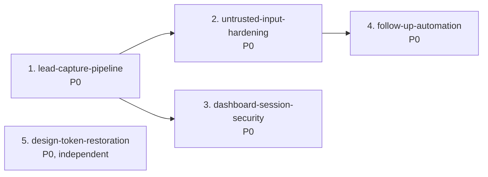

# MVP Specs — Status and Execution Order

Five specs that take the site from "forms don't submit" to a working MVP: a visitor submits a form → the lead is stored → Joey is notified → Joey sees it in a dashboard that isn't trivially breachable → a follow-up drip fires on schedule.

Each spec directory holds `requirements.md`, `design.md`, and `tasks.md`.

> **Read this first if you are picking up the work.** Spec 1 is partially implemented already — tasks 1-5 have working, tested code on disk. Everything else is spec-only. Details in [Implementation status](#implementation-status) below.

---

## Execution order



| # | Spec | Why this position |
|---|---|---|
| 1 | `lead-capture-pipeline` | Nothing else matters until forms actually submit. The database is empty today, so the dashboard shows zeros and the drip has nothing to send. |
| 2 | `untrusted-input-hardening` | Spec 1 is what makes visitor text reach email and AI prompts. Must land with or right behind it. |
| 3 | `dashboard-session-security` | Spec 1 puts real client PII behind a cookie whose value is a plaintext string committed to this repo. Needs Spec 1 done, otherwise parallel. |
| 4 | `follow-up-automation` | Turn the drip on once inputs are sanitised. Largest spec; also the one with no schedule at all today. |
| 5 | `design-token-restoration` | Touches no shared code. Can run at any point, including in parallel with 1-4. |

1 → 2 → 4 is a chain. 3 needs 1. 5 is free-floating.

---

## What each spec does

**1. `lead-capture-pipeline`** — Wire both forms to `POST /api/leads`. Add server-side Zod validation (the `src/lib/validation/` directory was empty), wrap the lead and follow-up inserts in a transaction (there were no transactions anywhere in `src`), and add the six missing indexes (the schema had zero).

**2. `untrusted-input-hardening`** — Escape lead text in outbound HTML email including the `mailto:`/`tel:` attribute contexts, delimit lead data in AI prompts so a submission can't rewrite Joey's outbound email, fix a `$`-expansion bug in `fillPromptTemplate`, add Twilio signature validation to the currently-unauthenticated SMS webhook, and make missing env vars fail with a named 503 instead of degrading silently.

**3. `dashboard-session-security`** — Replace the hardcoded `'joey_dashboard_authenticated'` cookie value (duplicated in three files) with an HMAC-signed token carrying an expiry. Verification runs in Node-runtime code at both data boundaries; `proxy.ts` keeps a presence-only check for the redirect. Stays on cookie auth per the steering constraint.

**4. `follow-up-automation`** — Give the drip a schedule that the host actually honours, make cron auth fail closed, add a claim step so overlapping runs can't double-send, add bounded retry, and fix the daily summary that emails an empty digest every morning. Sends templated email for MVP with the Bedrock path behind a seam.

**5. `design-token-restoration`** — Migrate the palette into a `@theme` block so Tailwind v4 actually generates the tokens, remove the `bg-[black]`/`text-[white]` workarounds and the contrast bugs they caused, and fix `error.tsx` nesting a second `<html>` document.

---

## Implementation status

The intent was specs only. Implementation started before that was clarified, so Spec 1 is partly built. **Nothing is in a broken intermediate state** — `npm run typecheck`, `npm test` (118 passing), and `npm run build` all pass on the current tree.

### Spec 1, tasks 1-5: done

| Task | Files |
|---|---|
| 1. Verification baseline | `vitest.config.mts`, `tests/setup.ts`, `tests/harness.test.ts`, `test` + `test:watch` scripts in `package.json` |
| 2. Zod lead schema | `src/lib/validation/lead.ts`, `lead.test.ts` |
| 3. Validation in the route | `src/app/api/leads/route.ts`, `route.test.ts` |
| 4. Atomic write | same route — `db.transaction()` around both inserts |
| 5. Indexes | `src/lib/db/schema.ts`, `schema.test.ts` |

Also changed: `src/lib/services/follow-up-scheduler.ts` — `Lead['intent']` now references the canonical set in `src/lib/validation/lead.ts` instead of redeclaring a narrower union.

### Spec 1, tasks 6-8: not started

Task 6 was interrupted partway. The partial edit to `src/components/forms/LeadCaptureForm.tsx` has been reverted, so that file is untouched. Both forms still `console.log` instead of submitting.

One design note produced during the interrupted attempt, worth keeping: `attributeFieldErrors` in `src/lib/api/submit-lead.ts` maps wire field names back to form field names so a 422 can be shown against the right input. It exists and is tested but has no consumer yet. Task 6 needs to add a `serverFieldErrors` prop to `LeadCaptureForm` and have `getFieldError` consult it, showing server errors regardless of touched state.

### Specs 2-5: spec-only

No implementation.

---

## Blockers for whoever continues

**No database connection.** There is no `.env.local` and no `DATABASE_URL` in the environment, and `drizzle.config.ts:7` throws without one. Consequences:

- `npm run db:push` has **not** run. The six indexes exist in `schema.ts` but are **not applied to the Neon database.**
- Verified as far as possible without a connection: `drizzle-kit generate` against a dummy URL produced the expected index counts and emitted `CREATE INDEX "leads_email_idx"` rather than `CREATE UNIQUE INDEX`. The generated migration was deleted afterwards, since the project applies schema with `db:push` and `/drizzle` is gitignored.
- Spec 1 task 8's end-to-end browser check and most of Spec 4's live verification are also blocked.

After setting `DATABASE_URL`, run `npm run db:push`, then confirm the cron query plan:

```sql
EXPLAIN ANALYZE
SELECT * FROM follow_ups
WHERE status = 'scheduled' AND scheduled_for <= now();
```

Expect `Index Scan using follow_ups_status_scheduled_for_idx`. On a nearly empty table Postgres may legitimately prefer a sequential scan; `SET enable_seqscan = off` in the session confirms the index is usable.

**Operator tasks that gate verification.** None are code:

| Item | Gates |
|---|---|
| `RESEND_API_KEY` + verified sender | All email verification in Specs 2 and 4 |
| `CRON_SECRET` in Netlify | Spec 4 task 3 makes this required rather than optional |
| `SESSION_SECRET` in Netlify | New var introduced by Spec 3; login returns 503 without it |
| cron-job.org job | Spec 4 task 8 |
| DNS + Resend domain | Cosmetic until launch |
| Bedrock model access | **Not needed for MVP** — the drip is templated. Only needed to flip the Spec 4 task 2 flag later. |

Every env var addition needs a manual Netlify redeploy.

---

## Findings that changed the specs

Recorded here because they contradict things stated elsewhere in the repo.

**Tailwind v4 never loads `tailwind.config.ts`.** `globals.css` has `@import "tailwindcss"` with no `@config` and no `@theme` — grepping every CSS file for all four v4 directives returns zero matches. Per Tailwind's upgrade guide, JS configs "are no longer detected automatically in v4." So every custom token generates no CSS: `bg-navy`, `text-cerulean`, `shadow-soft`, `max-w-content`, and all five `Button.tsx` variants. Built-ins like `bg-white` still work, which is why the site looks partly right.

Two consequences: `quiet-luxury-visual-fix-plan.md` at the repo root **misdiagnosed this** as missing tokens and prescribed adding them to `tailwind.config.ts` — they are now in that file and still do nothing. And the steering rule in `.kiro/steering/project.md` names `tailwind.config.ts` as the accent source of truth, pointing at a file the build ignores. Spec 5 task 4 updates it.

**Four competing intent vocabularies, not three.** `src/config/form-fields.ts` offers `general` to users while `follow-up-scheduler.ts` omitted it — which is exactly why `api/cron/follow-ups/route.ts:99` casts `'general'` into a union that lacks it. The specs adopt the `LeadIntent` enum from `src/types/lead.ts` as canonical, since it is the declared type system and a superset. A test asserts the legacy `buying`/`selling`/`both` spellings are rejected so the vocabulary cannot drift back.

**Netlify scheduled functions cannot drive a Next route handler.** They only target functions in the Netlify functions directory and, per Netlify's docs, cannot be invoked by URL. `vercel.json` currently defines both crons and Netlify ignores it entirely, so **no schedule exists today.** Spec 4 uses cron-job.org, which is what HANDOFF.md always specified. Both current entries are also `0 7 * * *` = 2-3am Eastern, not the 7am the comments claim.

**`middleware.ts` is deprecated in Next 16**, renamed to `proxy.ts`. The docs also state proxy "should not attempt relying on shared modules or globals," which is why Spec 3 puts session verification in Node-runtime code rather than in the interceptor.

**`error.tsx` should use `unstable_retry`, not `reset`.** The shipped docs at `node_modules/next/dist/docs/01-app/03-api-reference/03-file-conventions/error.md` show `unstable_retry` was added in v16.2.0 and is now recommended: `reset()` only clears error state without re-fetching, so on a data-driven page it re-renders straight back into the same error.

**Two bugs found while implementing Spec 1**, both fixed in the code on disk:

- The lead schema's name rule was first written as a cross-field `superRefine`. Zod skips refinements when the base object already has errors, so a submission with a bad email *and* no name reported only the email — the visitor fixes it, resubmits, then discovers the second problem. Now a preprocess step plus a required field, so everything reports in one pass. Regression test included.
- `leads.email` should **not** get a unique constraint, contrary to the initial analysis. A repeat client legitimately submits twice (buy now, sell in three years) and a unique index would turn the second inquiry into a 500. The duplicate-from-retry problem it appeared to solve was caused by the partial write, which the transaction fixes.

---

## Pre-existing issues left alone

Out of scope, but they will show up:

- **Build warning:** Next infers the workspace root as `/Users/rwilliams/Projects/` because a `package-lock.json` exists one level up. Fixable with `turbopack.root` in `next.config.ts`.
- **No migration history.** `/drizzle` is gitignored and only `db:push` is used, so schema changes are not reviewable. Adopting migrations is a deploy-workflow change and needs a decision.
- **`src/lib/services/database-service.ts`** is a complete, correct 420-line data layer imported nowhere. The routes hand-roll their own queries.
- **Name splitting happens in three places** — the route, the schema, and `lofty.ts:26`.
- **Three more 501 stubs** beyond the two in HANDOFF's list: `/api/analytics`, `/api/lofty/sync`, `/api/lofty/webhook`.
- **17 markdown docs at the repo root**, several stale. `IMPLEMENTATION_COMPLETE.md` sits alongside five 501 stubs.
- **`.gitignore` ignores `.env*`**, so the `.env.example` that HANDOFF tells you to copy cannot exist in the repo.
- **HANDOFF.md's overview says Claude 4.5 Sonnet**; its own table and the code say 3.5. Code and `env.ts` agree with each other.
