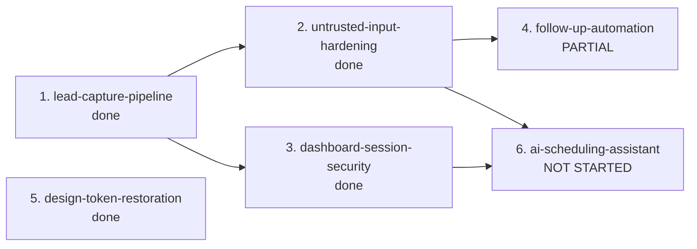

# MVP Specs — Status and Execution Order

Six specs. The first five take the site from "forms don't submit" to a working MVP: a visitor submits a form → the lead is stored → Joey is notified → Joey sees it in a dashboard that isn't trivially breachable → a follow-up drip fires on schedule. Spec 6 goes beyond MVP: a conversational assistant that answers questions and books real appointments.

Each spec directory holds `requirements.md`, `design.md`, and `tasks.md`.

> **Read this first if you are picking up the work.** Specs 1, 2, 3, and 5 are implemented. **Spec 4 (`follow-up-automation`) is partially done** — see the corrected table below; the earlier claim that none of its tasks had started is stale. **Spec 6 (`ai-scheduling-assistant`) is new and unstarted.** The Neon database is reachable and its schema is current. Details in [Implementation status](#implementation-status) below.

---

## Execution order



| # | Spec | Status | Why this position |
|---|---|---|---|
| 1 | `lead-capture-pipeline` | Done | Nothing else mattered until forms actually submitted. |
| 2 | `untrusted-input-hardening` | Done | Spec 1 is what makes visitor text reach email and AI prompts. |
| 3 | `dashboard-session-security` | Done | Spec 1 put real client PII behind a cookie whose value was a plaintext string committed to this repo. |
| 4 | `follow-up-automation` | **Partial** | Turn the drip on now that inputs are sanitised. Content seam and fail-closed auth landed; the queue, retry, and schedule have not. |
| 5 | `design-token-restoration` | Done | Touched no shared code, so it ran independently. |
| 6 | `ai-scheduling-assistant` | **Not started** | Depends on 2 for prompt delimiting and 3 for the HMAC session primitive it reuses. First spec where a model can cause a side effect, so it is last. |

Spec 4's prerequisites (1 and 2) are both complete. Spec 6's (2 and 3) are complete too, so neither is blocked in the dependency graph — but Spec 6 has two *operator* prerequisites that Spec 4 does not: Bedrock model access and a paid Calendly plan.

---

## What each spec does

**1. `lead-capture-pipeline`** — Wire both forms to `POST /api/leads`. Add server-side Zod validation (the `src/lib/validation/` directory was empty), wrap the lead and follow-up inserts in a transaction (there were no transactions anywhere in `src`), and add the six missing indexes (the schema had zero).

**2. `untrusted-input-hardening`** — Escape lead text in outbound HTML email including the `mailto:`/`tel:` attribute contexts, delimit lead data in AI prompts so a submission can't rewrite Joey's outbound email, fix a `$`-expansion bug in `fillPromptTemplate`, add Twilio signature validation to the previously-unauthenticated SMS webhook, and make missing env vars fail with a named 503 instead of degrading silently.

**3. `dashboard-session-security`** — Replace the hardcoded `'joey_dashboard_authenticated'` cookie value (duplicated in three files) with an HMAC-signed token carrying an expiry. Verification runs in Node-runtime code at both data boundaries; `proxy.ts` keeps a presence-only check for the redirect. Stays on cookie auth per the steering constraint.

**4. `follow-up-automation`** — Give the drip a schedule that the host actually honours, make cron auth fail closed, add a claim step so overlapping runs can't double-send, add bounded retry, and fix the daily summary that emails an empty digest every morning. Sends templated email for MVP with the Bedrock path behind a seam.

**5. `design-token-restoration`** — Migrate the palette into a `@theme` block so Tailwind v4 actually generates the tokens, remove the `bg-[black]`/`text-[white]` workarounds and the contrast bugs they caused, and fix `error.tsx` nesting a second `<html>` document.

**6. `ai-scheduling-assistant`** — A chat assistant in Joey's voice that answers lead questions and books real appointments through Calendly's Scheduling API. Finally writes the `conversations` table, which has existed and sat empty since the beginning and which the SMS webhook needs too. The substance of the spec is validation, not conversation: the model never originates a bookable time (availability is re-queried and matched exactly before every booking), `book_appointment` takes only a start time so an injected email address has no argument to land in, bookings bind to a server-established lead identity, and the endpoint is rate-limited before it can spend a token. Adds an `appointments` table and a `web` value to `conversation_type`.

---

## Implementation status

Verified on the current tree: `npm run typecheck` passes, `npm test` reports **460 passing across 23 files**, and `npm run build` completes clean — no middleware deprecation warning, and `proxy.ts` is picked up as `ƒ Proxy (Middleware)`.

### Specs 1, 2, 3, and 5: complete

All tasks checked off in their respective `tasks.md`. Landmarks you can grep for if you want to confirm quickly:

| Spec | Evidence on disk |
|---|---|
| 1 | `src/lib/validation/lead.ts`, `db.transaction()` in `src/app/api/leads/route.ts`, six indexes in `src/lib/db/schema.ts`, `src/lib/api/submit-lead.ts` wired into both forms |
| 2 | `src/lib/utils/escape.ts`, `src/lib/utils/require-env.ts`, Twilio `validateRequest` in `src/app/api/sms/webhook/route.ts` |
| 3 | `src/lib/auth/session.ts`, `src/lib/auth/rate-limit.ts`, `src/proxy.ts`; `middleware.ts` deleted and no hardcoded token constant remains |
| 5 | `@theme` block in `src/app/globals.css`; `tailwind.config.ts` deleted; `src/app/global-error.tsx` plus a document-shell-free `src/app/error.tsx` |

### Spec 4: partial

**The "not started" claim in earlier revisions of this file is wrong.** Re-verified by checking the tree directly:

| Task | Current state |
|---|---|
| 1. Templated bodies | **Done** — `src/lib/services/follow-up-content.ts` exists |
| 2. Content-source seam | **Done** — `getContentSource()` is called from `sendFollowUp`, and `FOLLOW_UP_CONTENT_SOURCE` is in `src/config/env.ts` defaulting to `template` |
| 3. Fail-closed cron auth | **Done** — `src/lib/api/cron-auth.ts` exists and `follow-ups/route.ts` calls `requireCronAuth` before anything else |
| 4. Claim + bounded batch | **Not done** — `src/lib/db/follow-up-queue.ts` absent; the route still selects then updates with no claim step, and the 500 ms sleep is still in the loop |
| 5. Bounded retry | **Not done** — no `attempts` column; `failureReason` does now record the real reason, so 5.4 is satisfied in isolation |
| 6. Immediate touchpoint | **Not done** — 4 follow-ups per lead |
| 7. Real daily summary | Unverified in this pass |
| 8. Real schedule | **Not done** — `vercel.json` still present and still ignored by Netlify |
| 9. Verification | — |

`src/lib/services/lead-mapping.ts` is also still absent, so the unchecked casts task 4 was meant to remove are presumably still in place.

### Spec 6: not started

No task has begun. Confirmed absent: `src/lib/api/calendly.ts`, `src/lib/ai/tools.ts`, `src/lib/ai/chat-session.ts`, `src/lib/api/request-limit.ts`, `src/lib/services/conversation-log.ts`, `src/components/chat/`. `src/app/api/ai/chat/route.ts` is still the five-line 501 stub, `conversations` still holds 0 rows, and `src/components/dashboard/AiLogsPanel.tsx` still imports `mockBedrockThreads`.

Schema additions Spec 6 needs, all confirmed absent from `schema.ts`: the `appointments` table, an `appointment_status` enum, a `web` value on `conversation_type`, and an assistant-disabled flag on `leads`.

---

## Database status

**The Neon database is reachable and Spec 1's schema changes are applied.** This reverses the blocker recorded in earlier revisions of this file.

Confirmed by direct read-only inspection:

- `DATABASE_URL` is set in `.env.local`, pointing at `ep-summer-breeze-axv50rqg.c-4.us-east-2.aws.neon.tech`, database `neondb`, PostgreSQL 18.6
- All five tables exist: `leads`, `follow_ups`, `conversations`, `analytics_events`, `ab_tests`
- **All six Spec 1 indexes are live**, so `npm run db:push` has run: `follow_ups_status_scheduled_for_idx`, `follow_ups_lead_id_idx`, `conversations_lead_id_idx`, `analytics_events_lead_id_idx`, `leads_email_idx`, `leads_created_at_idx`
- `leads_email_idx` is non-unique and there is no `_key` index on `leads`, satisfying requirement 4.5 — a repeat client can legitimately submit twice
- Data is flowing: 5 leads, 20 follow-ups, 0 conversations. The 4-per-lead ratio is what `POST /api/leads` writes today; expect 5 once Spec 4 task 6 lands.

### Schema changes Spec 4 still needs

Both gaps in task 4 are confirmed absent from the live database:

- `follow_up_status` is `scheduled, sent, delivered, opened, clicked, replied, failed` — **no `'sending'`**, which the claim mechanism depends on
- `follow_ups` has **no `attempts` column**, which bounded retry needs

One `npm run db:push` after editing `schema.ts` applies both. Adding an enum value and a defaulted integer column are additive, so no data loss. Note that Postgres cannot easily remove an enum value once added, so `'sending'` is effectively permanent — worth getting the name right the first time.

Optional confirmation of the cron query plan once `'sending'` and `attempts` are in place:

```sql
EXPLAIN ANALYZE
SELECT * FROM follow_ups
WHERE status = 'scheduled' AND scheduled_for <= now();
```

Expect `Index Scan using follow_ups_status_scheduled_for_idx`. On a 20-row table Postgres may legitimately prefer a sequential scan because it is genuinely cheaper; `SET enable_seqscan = off` in the session confirms the index is usable if so.

---

## Remaining blockers

### Environment variables

**`SESSION_SECRET` is now present in `.env.local`.** Earlier revisions of this file recorded it as missing and dashboard login as broken locally; that is no longer true.

Everything Spec 4 needs is present locally: `DATABASE_URL`, `CRON_SECRET`, `RESEND_API_KEY`, `JOEY_EMAIL`, `MAIL_FROM`, and the AWS Bedrock set. `CALENDLY_LINK` is set too. (Presence and non-emptiness were checked; values were not inspected.)

Spec 6 adds two that do **not** exist yet anywhere: `CALENDLY_API_TOKEN` and `CALENDLY_EVENT_TYPE_URI`.

### Operator tasks

| Item | Gates |
|---|---|
| Mirror all `.env.local` vars into Netlify | Any deployed verification |
| Verified Resend sender | Spec 4 task 9's live email checks |
| cron-job.org job | Spec 4 task 8 |
| DNS + Resend domain | Cosmetic until launch |
| Bedrock model access | **Not needed for MVP** — the drip is templated. Required for all of Spec 6, and to flip the Spec 4 task 2 flag. |
| Calendly **paid plan** + Personal Access Token | Spec 6 booking. Read-only endpoints work on Free, so availability can appear to work while `POST /invitees` returns 403 — anticipate that confusion. |

Every env var addition in Netlify needs a manual redeploy.

Note for anyone following `AWS_BEDROCK_INTEGRATION_GUIDE.md`: its `npm run test:bedrock` command assumes `tsx`, which is **not** in `devDependencies`. Node is v24 on this machine, so `node --env-file=.env.local script.mjs` works with no extra dependency.

### What is not blocked

All nine Spec 4 tasks can proceed. Tasks 1, 2, 3, 7, and 8 need no database at all; tasks 4, 5, and 6 need `db:push`, which now works.

---

## Findings that changed the specs

Recorded here because they contradict things stated elsewhere in the repo. The Tailwind and error-boundary items are now **fixed** by Spec 5, but the reasoning is kept because the misleading documents are still on disk.

**Tailwind v4 never loaded `tailwind.config.ts`.** `globals.css` had `@import "tailwindcss"` with no `@config` and no `@theme` — grepping every CSS file for all four v4 directives returned zero matches. Per Tailwind's upgrade guide, JS configs "are no longer detected automatically in v4." So every custom token generated no CSS: `bg-navy`, `text-cerulean`, `shadow-soft`, `max-w-content`, and all five `Button.tsx` variants. Built-ins like `bg-white` still worked, which is why the site looked partly right. **Fixed in Spec 5**: the palette lives in a `@theme` block and `tailwind.config.ts` is deleted.

`quiet-luxury-visual-fix-plan.md` at the repo root **misdiagnosed this** as missing tokens and prescribed adding them to `tailwind.config.ts`. That file no longer exists, so the document is now actively misleading and should be deleted or rewritten. The steering rule in `.kiro/steering/project.md` has been corrected to name the `@theme` block.

**Four competing intent vocabularies, not three.** `src/config/form-fields.ts` offers `general` to users while `follow-up-scheduler.ts` omitted it — which is exactly why `api/cron/follow-ups/route.ts:99` casts `'general'` into a union that lacks it. The specs adopt the `LeadIntent` enum from `src/types/lead.ts` as canonical, since it is the declared type system and a superset. A test asserts the legacy `buying`/`selling`/`both` spellings are rejected so the vocabulary cannot drift back. **Spec 4 task 4 removes the last two unchecked casts** via `src/lib/services/lead-mapping.ts`.

**Netlify scheduled functions cannot drive a Next route handler.** They only target functions in the Netlify functions directory and, per Netlify's docs, cannot be invoked by URL. `vercel.json` currently defines both crons and Netlify ignores it entirely, so **no schedule exists today.** Spec 4 uses cron-job.org, which is what HANDOFF.md always specified. Both current entries are also `0 7 * * *` = 2-3am Eastern, not the 7am the comments claim.

**`middleware.ts` is deprecated in Next 16**, renamed to `proxy.ts`. The docs also state proxy "should not attempt relying on shared modules or globals," which is why Spec 3 put session verification in Node-runtime code rather than in the interceptor. **Done**: `src/proxy.ts` ships and the build reports no deprecation warning.

**`error.tsx` should use `unstable_retry`, not `reset`.** The shipped docs at `node_modules/next/dist/docs/01-app/03-api-reference/03-file-conventions/error.md` show `unstable_retry` was added in v16.2.0 and is now recommended: `reset()` only clears error state without re-fetching, so on a data-driven page it re-renders straight back into the same error. **Done in Spec 5.**

**Two bugs found while implementing Spec 1**, both fixed:

- The lead schema's name rule was first written as a cross-field `superRefine`. Zod skips refinements when the base object already has errors, so a submission with a bad email *and* no name reported only the email — the visitor fixes it, resubmits, then discovers the second problem. Now a preprocess step plus a required field, so everything reports in one pass. Regression test included.
- `leads.email` should **not** get a unique constraint, contrary to the initial analysis. A repeat client legitimately submits twice (buy now, sell in three years) and a unique index would turn the second inquiry into a 500. The duplicate-from-retry problem it appeared to solve was caused by the partial write, which the transaction fixes.

---

## Pre-existing issues left alone

Out of scope, but they will show up:

- **Five 501 stubs**, all still placeholders: `/api/ai/chat`, `/api/ai/follow-up`, `/api/analytics`, `/api/lofty/sync`, `/api/lofty/webhook`. HANDOFF.md lists only the first two. Spec 6 claims `/api/ai/chat`; the other four remain unowned.
- **`src/lib/services/database-service.ts` is finally used by Spec 6** — task 2 wraps its conversation functions rather than reimplementing them. Until that lands it is still imported nowhere.
- **No migration history.** `/drizzle` is gitignored and only `db:push` is used, so schema changes are not reviewable. Adopting migrations is a deploy-workflow change and needs a decision. This matters more now that Spec 4 mutates an enum.
- **`src/lib/services/database-service.ts`** is a complete, correct data layer imported nowhere — confirmed still unreferenced. The routes hand-roll their own queries.
- **Name splitting happens in three places** — the route, the schema, and `lofty.ts:26`.
- **20 markdown docs at the repo root**, several stale. `IMPLEMENTATION_COMPLETE.md` sits alongside five 501 stubs, and `quiet-luxury-visual-fix-plan.md` now points at a deleted file.
- **`.gitignore` ignores `.env*`**, so the `.env.example` that HANDOFF tells you to copy cannot be committed.
- **HANDOFF.md's overview says Claude 4.5 Sonnet**; its own table and the code say 3.5. Code and `env.ts` agree with each other.
- **HANDOFF.md and this file's earlier revisions claimed there was no database connection.** There is. Treat HANDOFF's setup section with suspicion.

The previously-noted build warning about Next inferring the workspace root as `/Users/rwilliams/Projects/` does not reproduce on the current machine — the build output is clean. It was an artefact of the original author's checkout location, not a repo defect.
