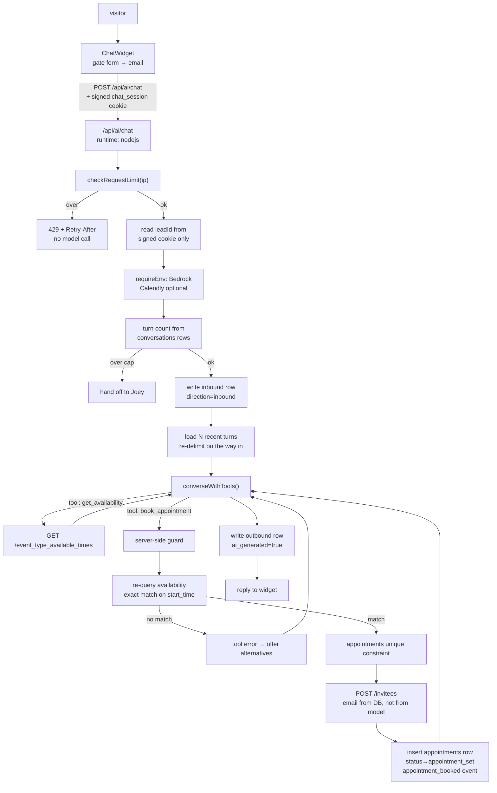

# AI Scheduling Assistant — Design

## Overview

Five layers, built bottom-up so each is useful before the next exists: conversation persistence, a Calendly client, tool support in the Bedrock client, the chat endpoint that ties them together, and the surfaces (public widget, dashboard history).

The organising principle is that **the model decides what to say and the server decides what is true.** Every fact the assistant states about availability originates from a tool result, and every side effect the model requests is re-validated by the server against the provider before it executes. The model is treated as an untrusted planner whose output is a request, not an instruction.

## Why Calendly, and why the API rather than the link

Calendly's [Scheduling API](https://developer.calendly.com/schedule-events-with-ai-agents) exposes the three calls this needs: `GET /event_types` to map intent onto a meeting kind, `GET /event_type_available_times` for real open slots, and `POST /invitees` to book on the invitee's behalf without a redirect or an iframe. Authentication can be a Personal Access Token scoped to the owner's own organization, which suits a single-host account and avoids an OAuth flow entirely.

Google Calendar was considered and rejected. It can create events and answer freebusy queries, but it has no notion of a *bookable slot* — buffers, minimum notice, daily caps, working hours, timezone rules, confirmation mail, and reminders would all have to be rebuilt. Those rules are the hard part of scheduling, and they are precisely where a language model reasons confidently and wrongly. Calendly already enforces them server-side, which means a bad model suggestion gets rejected by the provider rather than becoming a double-booking.

The cost is a paid Calendly plan; the Scheduling API is not available on Free. Content was rephrased for compliance with licensing restrictions.

The existing static `CALENDLY_LINK` is kept, not replaced. It becomes the documented fallback for Requirement 6.3 and stays in email and SMS signatures where it already works.

## Architecture



The load-bearing element is the `GUARD` → `RV` path. The model's `book_appointment` arguments are never passed through; the server re-queries availability inside the same request and requires an exact match on the normalised UTC start time. A hallucinated slot, a slot from an earlier turn that has since been taken, and a slot injected by hostile message text all fail identically at that point.

## Data Models

### New table: `appointments`

Booking outcomes need somewhere to live. Putting them in `conversations.metadata` would misuse a message log as an entity store, and Requirements 3.8 and 8.4 both need to query them.

| Column | Type | Purpose |
|---|---|---|
| `id` | uuid PK | |
| `lead_id` | uuid NOT NULL FK → `leads.id` ON DELETE CASCADE | Owner |
| `calendly_event_uri` | varchar(255) NOT NULL | Provider identity |
| `calendly_invitee_uri` | varchar(255) | For later cancel/reschedule work |
| `event_type_uri` | varchar(255) NOT NULL | Which meeting kind |
| `start_time` | timestamp NOT NULL | Normalised UTC |
| `end_time` | timestamp | From the Calendly response |
| `status` | `appointment_status` enum: `scheduled`, `canceled` | |
| `cancel_url` | text | Returned by Calendly |
| `reschedule_url` | text | Returned by Calendly |
| `created_at` | timestamp NOT NULL DEFAULT now | |

Indexes:

- `appointments_lead_id_idx` on `lead_id` — FK child columns are not auto-indexed in Postgres, matching the reasoning already recorded in `schema.ts`
- **unique** `appointments_calendly_event_uri_key` on `calendly_event_uri` — makes double-insert of the same provider event impossible at the database level rather than by application check
- **partial unique** on `(lead_id, start_time) WHERE status = 'scheduled'` — one lead cannot hold two live appointments at the same instant

Requirement 3.8's idempotency is satisfied by the unique constraint rather than by a read-then-write, which would race.

This is additive: a new table and a new enum. One `npm run db:push` applies it. Note the caveat the specs README already records — Postgres cannot easily remove an enum value once added, so `appointment_status` values are effectively permanent and worth naming correctly the first time.

### `conversations` — finally written, unchanged

No schema change. The table at `schema.ts:126-157` already fits. Mapping for this spec:

| Column | Web chat value |
|---|---|
| `type` | `email` is wrong and `sms` is wrong for web chat. See below. |
| `direction` | `inbound` / `outbound` |
| `content` | Message body |
| `ai_generated` | true for model output, false for static fallback text |
| `ai_model` | `env.AWS_BEDROCK_MODEL_ID` when generated |
| `metadata` | `{ channel: 'web', sessionId, toolCalls?, bedrockStopReason? }` |

`conversation_type` is `sms | email | phone | in_person` and has no `web` value. Adding one is the honest fix and is additive like the above. The alternative — overloading an existing value — would corrupt the `getConversionFunnel` query in `database-service.ts`, which filters `type = 'email'` to count emails sent. So: add `web` to `conversationTypeEnum` in the same `db:push`.

### `follow_ups.conversation_id`

Populated for the first time, via the existing `markFollowUpAsSent(id, conversationId)`. Not strictly required by this spec's requirements, but it is a one-line change once conversation rows exist and it retires a dangling FK.

## Components and Interfaces

### `src/lib/services/conversation-log.ts` (new)

A thin, intention-revealing wrapper over the existing unused data layer rather than a replacement for it. `database-service.ts` already has correct implementations; the problem is that nothing calls them and its function names describe storage rather than intent.

```ts
export interface LoggedMessage {
  leadId: string;
  channel: 'web' | 'sms';
  direction: 'inbound' | 'outbound';
  content: string;
  aiGenerated?: boolean;
  metadata?: Record<string, unknown>;
}

export async function logMessage(msg: LoggedMessage): Promise<Conversation>;
export async function loadRecentTurns(leadId: string, limit: number): Promise<Conversation[]>;
export async function countTurns(leadId: string): Promise<number>;
```

`countTurns` is what enforces Requirement 4.4. Deriving the turn cap from database rows rather than from a cookie counter means a client cannot reset it by replaying an older cookie.

`loadRecentTurns` returns oldest-first for prompt assembly, which is the opposite of `getConversationsByLeadId`'s `desc` ordering — worth being explicit about, because getting it backwards produces a subtly incoherent conversation rather than an error.

### `src/lib/api/calendly.ts` (new)

Isolated so it can be tested against recorded fixtures with no network, and so a Google Calendar implementation could satisfy the same interface later.

```ts
export interface Slot { startTime: string; /* UTC ISO with Z */ schedulingUrl?: string }

export interface BookingRequest {
  eventTypeUri: string;
  startTime: string;
  invitee: { name: string; email: string; timezone: string };
  location?: { kind: string; location?: string };
}

export interface Booking {
  eventUri: string;
  inviteeUri: string;
  startTime: string;
  endTime?: string;
  cancelUrl: string;
  rescheduleUrl: string;
}

export function isCalendlyConfigured(): boolean;
export async function listEventTypes(): Promise<EventType[]>;
export async function listAvailableTimes(eventTypeUri: string, from: Date, to: Date): Promise<Slot[]>;
export async function createInvitee(req: BookingRequest): Promise<Booking>;
```

Three provider details that will otherwise cost an afternoon each:

- `listAvailableTimes` must clamp its range to 31 days and reject past start times, both documented Calendly constraints. The clamp belongs here, not at the call site, so no caller can violate it.
- `createInvitee` requires a `location` object **unless** the event type specifies no location, in which case it must be omitted. When the host's location kind can require invitee input — `ask_invitee`, `outbound_call`, or multiple custom or physical locations — `location.location` must carry the detail. Getting this wrong is a 400 on every booking.
- Start times must be UTC with a trailing `Z`. Normalisation happens in this module so the tool layer cannot pass a local-time string.

Configuration: `CALENDLY_API_TOKEN` (Personal Access Token) and `CALENDLY_EVENT_TYPE_URI` added to `src/config/env.ts` as optional strings, following the established pattern of optional-at-parse and asserted-at-request. `isCalendlyConfigured()` is the single predicate that drives Requirement 6.2.

### `src/lib/api/bedrock.ts` (extended, not rewritten)

`sendBedrockMessage` stays exactly as it is. The follow-up-automation spec's AI content source depends on it, and rewriting a working function that another spec references is gratuitous risk.

A new export is added for the tool loop:

```ts
export interface ToolDefinition {
  name: string;
  description: string;
  inputSchema: Record<string, unknown>;
}

export interface ToolInvocation { toolUseId: string; name: string; input: unknown }

export type ToolOutcome =
  | { toolUseId: string; ok: true; content: unknown }
  | { toolUseId: string; ok: false; error: string };

export async function converseWithTools(opts: {
  messages: BedrockMessage[];
  systemPrompt: string;
  tools: ToolDefinition[];
  maxTokens?: number;
  onToolUse: (calls: ToolInvocation[]) => Promise<ToolOutcome[]>;
  maxToolRounds?: number;
}): Promise<{ text: string; rounds: number; stopReason: string }>;
```

Implemented with `ConverseCommand` and `toolConfig` rather than by hand-assembling `tools` into the `InvokeModel` body. Converse handles the tool-result round trip as a first-class message type, which is the part that is fiddly and easy to get subtly wrong with raw `InvokeModel`.

`maxToolRounds` defaults to 3 and is the mechanism for Requirements 4.2 and 4.3. On reaching the cap the loop stops requesting tools and asks for a final text answer, so the lead gets a usable reply instead of a timeout.

One existing defect to fix while here: `sendBedrockMessage` collapses every failure into `throw new Error('Failed to get AI response')`, discarding the cause. Access-denied (model access not granted) and throttling are operationally very different and currently indistinguishable. Both functions should preserve the cause so Requirement 6.1 can produce a named error.

### `src/lib/ai/tools.ts` (new)

Where model-requested actions become server-validated operations. This module is the security boundary, and it is deliberately separate from both the Bedrock client and the Calendly client so that neither can be called with unvalidated arguments by accident.

```ts
export function buildToolset(ctx: AssistantContext): ToolDefinition[];
export function makeToolExecutor(ctx: AssistantContext):
  (calls: ToolInvocation[]) => Promise<ToolOutcome[]>;
```

`AssistantContext` carries `{ leadId, leadEmail, leadName, timezone }` — resolved by the server from the database before the loop begins. Tool arguments are parsed with Zod (Requirement 5.2); anything unparseable is returned to the model as a tool error rather than throwing (Requirement 5.3).

Two tools, offered only when `isCalendlyConfigured()`:

**`get_availability`** — input `{ fromDate, toDate }`, clamped to 31 days. Returns structured slots, not prose (Requirement 5.7).

**`book_appointment`** — input `{ startTime }`. Deliberately **nothing else.** No email, no name, no event type. Those come from `AssistantContext`, which the model cannot influence, which is how Requirements 3.1 and 5.4 are enforced structurally rather than by instruction. An injected "book for attacker@example.com" has no argument to land in.

Execution order inside `book_appointment`:

1. Normalise `startTime` to UTC
2. Re-query `listAvailableTimes` for the day containing it
3. Require an exact match, else return a tool error listing real alternatives
4. `createInvitee` with the email from `AssistantContext`
5. Insert the `appointments` row; a unique-constraint violation is treated as success (already booked), satisfying Requirement 3.8
6. Advance lead status to `appointment_set` and record the `appointment_booked` event
7. Return the booking, including cancel and reschedule URLs

Steps 2 and 3 are the whole point of the spec.

### `src/lib/api/request-limit.ts` (new)

The existing `src/lib/auth/rate-limit.ts` is not reused directly. Its exported vocabulary is failure-specific — `recordFailure`, `clearFailures`, `MAX_FAILED_ATTEMPTS` — and a successful chat request must still count, which inverts its whole model. Refactoring a shipped security control to serve a second caller risks the first.

What *is* reused is `rateLimitKey`, imported from that module: the client-IP extraction with its Netlify header ordering and its shared fallback bucket is genuinely general, carefully reasoned, and should not be duplicated.

```ts
export interface RequestLimitResult { allowed: boolean; retryAfterSeconds?: number }
export function checkAndCount(key: string): RequestLimitResult;
```

The same per-instance caveat applies and must be restated at the call site (Requirement 4.9). It matters more here than for login: the threat is spending money rather than guessing a password, and horizontal scaling means the effective ceiling is higher than the configured one. The `login_attempts`-table follow-up already noted in `rate-limit.ts` would fix both call sites and is out of scope.

### Identity: `src/lib/ai/chat-session.ts` (new)

Requirement 3 needs a lead identity the model cannot influence. The mechanism reuses the HMAC primitive from `src/lib/auth/session.ts` that the dashboard-session-security spec already established — same signing approach, different payload, different cookie name.

```ts
export interface ChatSessionPayload { leadId: string; exp: number }
export function createChatSession(leadId: string): string;
export function verifyChatSession(token: string | undefined): ChatSessionPayload | null;
```

Flow: the widget opens with a short gate form (name, email, intent). Submitting it goes through the existing validated `POST /api/leads` path, which creates or matches a lead row. The response sets a signed `chat_session` cookie. Every subsequent chat request reads `leadId` from that cookie and from nowhere else.

Deliberate consequence: chat requires an email before it will converse. That is a small conversion cost, accepted because anonymous chat plus a booking tool means anyone can put an appointment on Joey's calendar under any address, which damages both his schedule and his sending reputation.

`SESSION_SECRET` signs this too. It is already required by the dashboard and is present in `.env.local`.

### `src/app/api/ai/chat/route.ts` (replaces the 501 stub)

`export const runtime = 'nodejs'` for Requirement 7.5. Order of operations matters and is fixed:

1. Rate limit by IP — before any work, so refusal is cheap
2. Verify the `chat_session` cookie; no valid session means no conversation
3. Assert configuration with `requireEnv` — *after* the above, so an unauthenticated caller cannot enumerate missing variables (Requirement 6.7)
4. Validate the message with Zod, including the length cap
5. Check the turn cap via `countTurns`
6. Write the inbound row; abort if it fails (Requirement 1.8)
7. Load and re-delimit history, run `converseWithTools`
8. Write the outbound row
9. Return the reply

Step 3 following step 1 is the same ordering the dashboard data route already uses, and step 6 preceding step 7 is what guarantees no reply exists that cannot be reconstructed.

### `src/app/api/dashboard/leads/[id]/history/route.ts` (new)

Session-verified with `verifySession`, exactly as `/api/dashboard/data` does. A separate endpoint rather than a widening of the existing payload, which already fetches every follow-up unbounded and should not also carry every message.

### `src/components/chat/ChatWidget.tsx` (new)

Gate form, message list, composer. Accessibility is not optional here: the message list is a live region so screen readers announce replies, focus moves predictably between gate and composer, the panel traps focus while open and restores it on close, and it is fully keyboard operable including Escape to close. Colours come from the `@theme` tokens in `globals.css` — no hardcoded hex, no `bg-[black]`-style arbitrary values, per the project steering rule.

### `src/components/dashboard/AiLogsPanel.tsx` (repointed)

Fetches real history instead of importing `mockBedrockThreads`. Its `BedrockMessage` shape uses `client | ai` roles which do not map onto `direction`, so an adapter converts rows to its view model. `src/data/mockBedrockLogs.ts` is deleted once nothing imports it. The "Take Over Chat" button gets a real behaviour: set an assistant-disabled flag on the lead so inbound messages are logged without a generated reply (Requirement 8.5).

## Error Handling

Calendly status codes, mapped per their documented guidance:

| Condition | Server behaviour | Lead sees |
|---|---|---|
| 400 validation | Log the field, return tool error to the model | A request to confirm details |
| 401 bad token | Named config error; disable booking tools for the request | Static link fallback |
| 403 scope or plan | Same as 401 — a Free-plan account fails here | Static link fallback |
| 404 slot or event type gone | Tool error with fresh alternatives | "That one just went — how about…" |
| 5xx transient | Retry with backoff, bounded | Static link fallback if it persists |

Bedrock:

| Condition | Handling |
|---|---|
| `AccessDeniedException` | Model access not granted. Named 503 via `requireEnv` semantics, cause preserved |
| `ThrottlingException` | One bounded retry, then a graceful message |
| Malformed tool arguments | Tool error back to the model; it retries or explains |
| Tool round cap reached | Final text answer requested; partial help returned |

No provider payload, status code, or configuration value reaches the browser (Requirements 6.5, 7.4).

## Testing Strategy

The security properties are what deserve the effort. Each of these is a test that fails loudly if the guarantee regresses:

- **Hallucinated slot is refused.** Model requests a `startTime` absent from the availability fixture; assert no `POST /invitees` and no `appointments` row.
- **Stale slot is refused.** Availability returns a slot, the re-query no longer contains it; assert refusal and that alternatives are offered.
- **Injected email cannot be booked.** Message body contains instructions to book for another address; assert the booking used the `AssistantContext` email. Reinforced by `book_appointment` having no email argument at all.
- **Idempotency.** Two concurrent bookings for the same slot; assert one `appointments` row and no error surfaced to the lead.
- **Rate limit precedes the model.** Exceed the limit; assert 429 with `Retry-After` and zero Bedrock calls.
- **Turn cap survives cookie replay.** Replay an older cookie; assert the cap still holds because it is derived from row count.
- **Config absent means no promise.** With Calendly unconfigured, assert the toolset is empty, the static link is offered, and no message claims a booking.
- **Env probing.** Unauthenticated request against a deployment missing variables; assert the response does not name them.
- **Inbound row precedes generation.** Force the insert to fail; assert no model call and no reply.
- **History is re-delimited.** Store an inbound message containing delimiter tokens; assert the assembled prompt is not breakable.
- **31-day clamp.** Request a 90-day window; assert the outgoing query is clamped.
- **UTC normalisation.** Pass a local-time string; assert the outgoing `start_time` ends in `Z`.

Calendly is exercised through recorded fixtures, never live, so the suite stays offline and deterministic. Bedrock is mocked at the `converseWithTools` boundary for route tests and at the AWS client boundary for loop tests.

Accessibility: keyboard-only traversal of gate form through composer, live-region announcement of replies, and focus restoration on close.

## Operational note

Three things must be true before this works in production, none of them code:

1. **Bedrock model access granted** for `anthropic.claude-3-5-sonnet-20241022-v2:0` in the configured region, with the AWS variables set in Netlify.
2. **Calendly on a paid plan**, with `CALENDLY_API_TOKEN` and `CALENDLY_EVENT_TYPE_URI` set in Netlify. Read-only calls succeed on Free, so availability may appear to work while booking returns 403 — a confusing failure worth anticipating.
3. **A redeploy after each variable is added.** Netlify does not pick up new environment variables without one.

Until Calendly is configured the assistant still runs: it answers questions and shares the static link, which is Requirement 6.3 doing its job rather than a degraded state. Until Bedrock is configured the chat endpoint returns a named 503 and the widget should not be mounted.

The `FOLLOW_UP_CONTENT_SOURCE` flag is unrelated to this spec and stays on `template`. Turning the chat assistant on does not imply turning AI-generated drip email on; they are separate decisions with separate blast radii.
