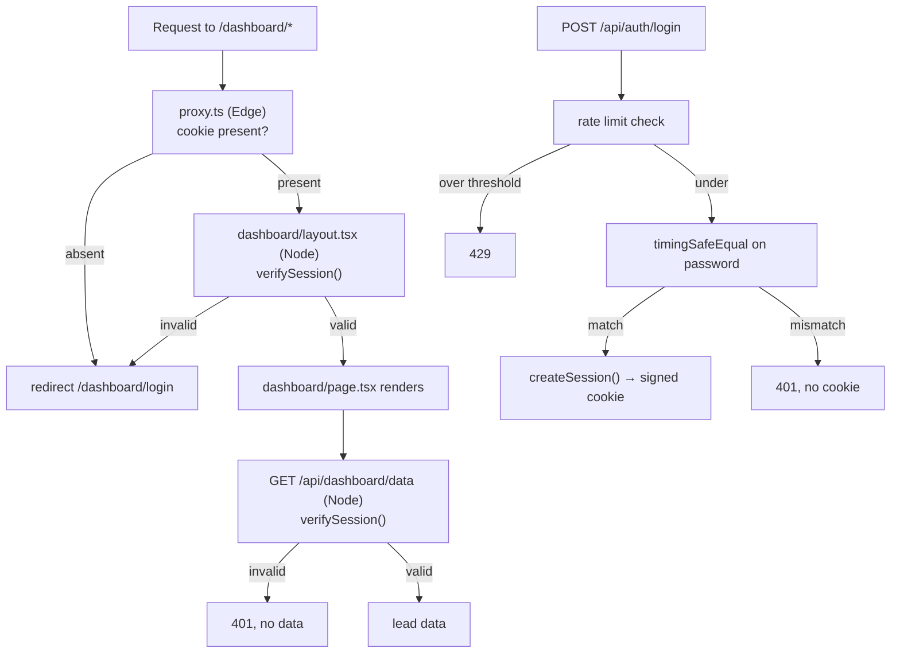

# Dashboard Session Security — Design

## Overview

A signed cookie replaces the static string. The important structural decision is *where* verification happens: not in the request interceptor, but in Node-runtime code at the two places that actually expose data.

## The layering decision

The existing `middleware.ts` avoids `process.env` on purpose — the login route's comment says Edge-runtime env access was unreliable. Rather than fight that, the design works with it, and Next 16's own guidance for this file agrees: proxy "is meant to be invoked separately of your render code and in optimized cases deployed to your CDN… you should not attempt relying on shared modules or globals."

So:

| Layer | Runtime | Check | Purpose |
|---|---|---|---|
| `proxy.ts` | Edge | Cookie present? | Fast redirect so visitors land on login instead of a flashing empty dashboard |
| `dashboard/layout.tsx` | Node (server component) | Full signature + expiry | Blocks page render |
| `/api/dashboard/data` | Node (route handler) | Full signature + expiry | Blocks data access |

A forged cookie passes the proxy — that is fine and expected, because the proxy is not the boundary. It then fails at both the layout and the data endpoint. Requirement 3.4 is satisfied by having two independent checks rather than one shared one.

This is a defence-in-depth arrangement where the outermost layer is deliberately the weakest and is documented as such, which is safer than an outer layer that *looks* authoritative but depends on unreliable secret access.

## Architecture



## Components and Interfaces

### `src/lib/auth/session.ts` (new)

```ts
export const SESSION_COOKIE_NAME = 'dashboard_auth';
export const SESSION_MAX_AGE_SECONDS = 60 * 60 * 24 * 7;

export function createSession(now?: Date): string;
export function verifySession(cookieValue: string | undefined): boolean;
export function sessionCookieOptions(): { httpOnly: true; secure: boolean; sameSite: 'lax'; maxAge: number; path: '/' };
```

Token format: `base64url(payload).base64url(hmacSha256(secret, payload))` where payload is JSON `{ exp: <unix seconds> }`.

Design points:

- **Node `crypto`, not Web Crypto.** Both verification sites run in the Node runtime, so `createHmac` and `timingSafeEqual` are available and synchronous. Web Crypto would force an async API for no benefit here.
- **`timingSafeEqual` needs equal-length buffers** or it throws. The implementation compares lengths first and returns `false` on mismatch, which leaks only the length of a signature that is a fixed size anyway.
- **Expiry lives inside the signed payload**, not only in the cookie `maxAge`. `maxAge` is a client-side hint that a crafted request can simply ignore; the signed `exp` cannot be altered without breaking the signature. This is what makes Requirement 1.6 meaningful.
- **No secret, no session.** `createSession` throws when `SESSION_SECRET` is absent (Requirement 1.8), and `verifySession` returns `false` rather than throwing, so a misconfigured deploy denies access instead of granting it. The login route maps the throw to a 503.
- **`verifySession` never throws** (Requirement 1.7). Malformed base64, absent separator, non-JSON payload, and missing `exp` all return `false`.

New env var: `SESSION_SECRET`. Added to the Zod schema as optional (so `next build` still works) and asserted at request time via the `requireEnv` helper from Spec 2.

### `src/lib/auth/rate-limit.ts` (new)

```ts
export function checkRateLimit(key: string): { allowed: boolean; retryAfterSeconds?: number };
export function recordFailure(key: string): void;
export function clearFailures(key: string): void;
```

A module-scoped `Map` of key to attempt timestamps, with a sliding window. Threshold and window are module constants.

**Known limitation, stated plainly:** this is per-instance. Netlify scales lambdas horizontally, so an attacker distributing requests across cold starts gets more attempts than the threshold implies. It is still worth having — it stops naive scripted guessing against a warm instance — but it is not a strong control. A `login_attempts` table would be, and is the documented follow-up. Requirement 2.6 is met as specified; the spec records that "best-effort" is the accepted level.

The keying uses the client IP from forwarded headers, with a shared fallback bucket when no IP is available so the limiter cannot be trivially bypassed by stripping the header.

### `src/app/api/auth/login/route.ts` (rewritten)

Order of operations matters: rate limit first, then password comparison, then session issuance. Checking the rate limit before the comparison is what makes it a rate limit rather than a delay.

`timingSafeEqual` on the password requires equal-length buffers. Rather than compare raw passwords, both sides are hashed with SHA-256 first, producing fixed-length digests. This sidesteps the length problem and avoids leaking the configured password's length.

### `src/app/api/dashboard/data/route.ts` (modified)

The local `AUTH_TOKEN` constant and `isAuthenticated` helper are deleted and replaced with `verifySession(cookieStore.get(SESSION_COOKIE_NAME)?.value)`. The rest of the handler is unchanged.

### `src/app/dashboard/layout.tsx` (modified)

Becomes an async server component that reads the cookie via `await cookies()` and calls `redirect('/dashboard/login')` on failure. It keeps its existing wrapper markup.

This is the change that closes the real hole. Today the dashboard page is a client component whose only protection is a 401 handler, so a forged cookie renders the page shell and the client-side redirect is cosmetic.

### `proxy.ts` (new, replaces `middleware.ts`)

Same matcher (`['/dashboard/:path*']`), same login-path exemption, same redirect. The check narrows from a value comparison to a presence check, and a header comment states that this is a redirect affordance and that authorization lives in the layout and the data route.

Exports a named `proxy` function. `middleware.ts` is deleted.

On Requirement 4.3: `/dashboard/:path*` with the `*` modifier makes the trailing segment optional under path-to-regexp, so bare `/dashboard` matches. The internal `startsWith('/dashboard')` guard is retained so the handler is correct either way, and the bare path gets an explicit smoke test.

## Error Handling

| Condition | Response |
|---|---|
| No cookie on a dashboard path | 302 to `/dashboard/login` |
| Forged or expired cookie, page request | 302 to `/dashboard/login` |
| Forged or expired cookie, data request | 401, no body data |
| Wrong password | 401, no cookie set |
| `ADMIN_PASSWORD` unset | 503 |
| `SESSION_SECRET` unset | 503 |
| Over rate limit | 429 with `Retry-After` |

## Testing Strategy

Session module unit tests are the core of this spec, because they encode the security properties:

- Valid round trip: `verifySession(createSession())` is `true`
- Tampered payload: decode, alter `exp`, re-encode with the original signature → `false`
- Wrong signature: valid payload with a signature generated from a different secret → `false`
- Expired: create with a backdated `now` → `false`
- Malformed: empty string, `undefined`, no separator, non-base64, valid base64 of non-JSON, JSON without `exp` → all `false`, none throw
- No secret: `createSession` throws, `verifySession` returns `false`

Route tests cover login (correct, wrong, unconfigured, over-limit) and the data endpoint (forged cookie → 401, valid → 200). The forged-cookie test uses the exact literal `'joey_dashboard_authenticated'` that works today, which makes it a regression test for this specific vulnerability.

Rate limiter tests manipulate injected time rather than sleeping, so the window-reset case does not slow the suite.

## Operational note

`SESSION_SECRET` must be set in Netlify before deploying this spec, followed by a manual redeploy. Without it the dashboard returns 503 on login — deliberately, since the alternative is an unsigned session. Rotating the secret invalidates all existing sessions, which is the correct behaviour and worth knowing before rotation.
