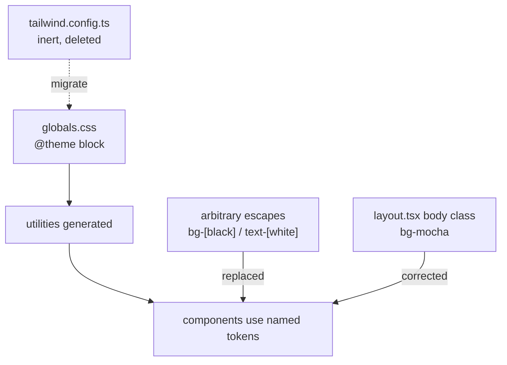

# Design Token Restoration — Design

## Overview

Move the palette from an inert JavaScript config into a `@theme` block in `globals.css`, then remove the workarounds that existed because the palette never worked.

## Why native `@theme` over a `@config` directive

Two options close the gap. Adding `@config "../../tailwind.config.ts"` to `globals.css` is a one-line fix that keeps the existing file working. Migrating to `@theme` is a larger diff.

`@theme` is the choice here because the tokens end up next to the CSS variables already living in `globals.css`, which removes the split-brain problem the earlier fix plan identified as "design token fragmentation" — one file for tokens, another for variables, with no clear precedence. It is also the direction Tailwind v4 documents as primary, with JavaScript configs described as backward compatibility.

The cost is that the steering rule pointing at `tailwind.config.ts` has to be updated. That is covered in Requirement 4 and was approved.

## Namespace mapping

Tailwind v4 derives utilities from theme variable namespaces. The existing config translates as:

| Config key | Theme variable | Generates |
|---|---|---|
| `colors.navy` | `--color-navy` | `bg-navy`, `text-navy`, `border-navy` |
| `colors.neutral.500` | `--color-neutral-500` | `bg-neutral-500` etc. |
| `fontFamily.serif` | `--font-serif` | `font-serif` |
| `boxShadow.soft` | `--shadow-soft` | `shadow-soft` |
| `borderRadius.xl` | `--radius-xl` | `rounded-xl` |
| `maxWidth.content` | `--container-content` | `max-w-content` |

`maxWidth` mapping to `--container-*` is the non-obvious one — in v4 that namespace drives both container query variants and `max-w-*` sizing utilities.

Semantic groups with sub-keys flatten. `accent: { DEFAULT, foreground, hover }` becomes `--color-accent`, `--color-accent-foreground`, `--color-accent-hover`, producing `bg-accent`, `text-accent-foreground`, `hover:bg-accent-hover`.

Overriding `--radius-xl` replaces Tailwind's built-in `rounded-xl` value (0.75rem) with 1rem, matching the current config's intent.

## What stays in `:root`

`globals.css` currently defines several variables in `:root`. After the migration:

| Variable | Destination | Reason |
|---|---|---|
| `--color-background`, `--color-foreground`, `--color-accent` | `@theme` | Should generate `bg-background` etc. |
| `--font-serif`, `--font-sans`, `--font-mono` | `@theme` | Should generate `font-*`, and must resolve through the theme rather than an incidental cascade override |
| `--background`, `--foreground` | `:root` | Consumed directly by the `body` rule; no utility needed |
| `--accent`, `--accent-hover` | `:root` | Consumed by the `.eyebrow` utility class |
| `color-scheme: light` | `:root` | Not a token |
| `--neutral-50`, `--neutral-100`, `--neutral-900` | Removed | Duplicates of the theme ramp, unreferenced |

The `body` rule keeps its explicit `background-color` and `color`. It is currently the only reason the page renders on the right background at all, since `bg-mocha` on `<body>` produces nothing. Once tokens work, `bg-mocha` will apply — and it is warm near-black, which would override the linen background the design intends. So `layout.tsx` needs its body class corrected as part of this work, not just the token definitions. This is the one place where making tokens work *changes* rendering rather than restoring it, and it is easy to miss.

## Scoping source detection

Tailwind v4 runs automatic source detection from the git root by default. Every non-gitignored file is scanned for class strings, so a file that merely *mentions* a class generates a real rule for it. This repo mentions the escapes in prose in a lot of places — the root markdown plans (`UX_ENHANCEMENT_PLAN.md`, `quiet-luxury-visual-fix-plan.md`), the spec documents under `.kiro/`, the steering file, and the escape-regression test itself all name `bg-[black]` and `text-[white]`. The result was 9 dead escape rules in the compiled CSS after every component escape had already been removed from `src/`.

The fix is `@import "tailwindcss" source("../../src");` in `src/app/globals.css`. The path is relative to the CSS file, so `../../src` from `src/app/` resolves to `src/`.

The mechanism is worth recording, because the intuitive fix is wrong. A bare `@source "../../src"` does **not** work: `@source` *adds* to automatic detection rather than replacing it, so git-root scanning continues and the dead rules survive. Only `source(...)` on the import relocates the detection base. This was verified empirically against the installed `@tailwindcss/node@4.2.4` `compile()` API, which exposes a `root` field describing the detection base — the bare `@source` form returned `root: null`, meaning automatic git-root detection was still active, while the `source("../../src")` form returned a relocated root with an empty `sources` array. `source(none)` paired with an explicit `@source` also works, but base relocation was preferred because it cannot be silently defeated later by someone adding a stray bare `@source`.

Narrowing to `src/` is safe because no Tailwind class strings exist outside it. The root-level config files (`middleware.ts`, `next.config.ts`, `drizzle.config.ts`, `eslint.config.mjs`, `postcss.config.mjs`, `vitest.config.mts`) contain none, there are no MDX or HTML templates outside the test fixtures, and there is no HTML in `public/`. A differential scan between git-root and `src/` scoping showed 60 real rules dropped, all doc-only.

The one consequence is that `tests/__fixtures__` sits outside `src/`, so the token build-assertion test must register the fixture directory as its own source at compile time rather than relying on automatic detection. Widening the production scope to accommodate a test fixture would defeat the purpose.

## Architecture

## Components and Interfaces

### `src/app/globals.css`

Gains a `@theme` block after the import, carrying the full palette, the three font families, `--shadow-soft`, `--container-content: 80rem`, and `--radius-xl: 1rem`. The `:root` block is trimmed to the variables above.

### `tailwind.config.ts`

Deleted. `postcss.config.mjs` needs no change — it already loads only `@tailwindcss/postcss`, with no reference to the config file.

### Component audit

Every arbitrary `[black]` / `[white]` escape is replaced with the token that expresses the intent. The mapping is not mechanical, because several escapes were applied to *dark* surfaces where `black` was standing in for a light token:

- `sections/PropertyCategories.tsx` — `bg-[black]` section with `text-[white]` headings, but cards are `bg-[white]` with `text-[black]` bodies. The section is a dark band; `bg-onyx` with light text on the band and `bg-linen` cards with `text-navy` bodies preserves the intent.
- `sections/ValueProposition.tsx` — same dark-band pattern, plus `text-[black]` used for an *accent* eyebrow on a dark background, which is currently invisible. That one becomes `text-champagne`.
- `layout/Navigation.tsx` — the worst case. `bg-[black]` dropdown panels containing `text-[black]` items, so the menu text is black on black. Also uses `text-[black]` as the active-link colour over a dark hero. Active state becomes `text-champagne`, panel becomes `bg-navy`, items become light.
- `ui/Input.tsx`, `ui/Textarea.tsx`, `forms/FormNavigation.tsx` — light form surfaces. `bg-[white]` → `bg-linen` or `bg-white`, `text-[black]` → `text-navy`, borders and placeholders to `navy` at reduced opacity.
- `(marketing)/privacy`, `terms`, `buy-home`, `sell-home`, `get-started` — light content pages using `bg-[white]` / `text-[black]` / `text-[black]/70`. These become `bg-linen` / `text-navy` / `text-stone`.

Contrast is checked for each changed pair against WCAG AA — 4.5:1 for body text, 3:1 for large text. The palette supports this: `navy` (#1C2A39) on `linen` (#FAF9F6) is roughly 13:1, and `stone` (#707070) on `linen` is roughly 4.9:1, both passing for body text. `champagne` (#C5A059) on `navy` is roughly 5.4:1. `cerulean` (#0A7EA4) on white is roughly 4.6:1, which passes for body text but only just — worth noting for any future use on tinted backgrounds.

### Error boundaries

`src/app/error.tsx` is renamed to `src/app/global-error.tsx`. It already renders `<html>`/`<body>` and is already named `GlobalError`, so the file was simply in the wrong place.

A new `src/app/error.tsx` handles in-layout errors without a document shell, styled with working tokens.

**Next 16 recovery prop.** The shipped docs at `node_modules/next/dist/docs/01-app/03-api-reference/03-file-conventions/error.md` show that `unstable_retry` was added in v16.2.0 and is now the recommended recovery prop: "In most cases, you should use `unstable_retry()` instead" of `reset()`. The distinction is real — `unstable_retry()` re-fetches and re-renders the boundary's children, while `reset()` only clears error state and re-renders without re-fetching. For a data-driven page a bare `reset()` will often re-render straight back into the same error.

The current `error.tsx` uses `reset`. Both boundaries take `unstable_retry` as the primary action. The `unstable_` prefix signals the API may change, so the prop is destructured in one place per file to keep any future rename to a single edit.

## Data Models

This spec introduces no runtime data structures. It moves CSS tokens between files, rewrites class strings in JSX, and renames two files. Nothing here gains a schema, a serialized form, or persisted state.

The closest thing to a model is the theme token namespace mapping — which config key becomes which CSS variable, and which utility that variable generates. That is the table under "Namespace mapping" above and is not repeated here. It is worth calling a model because it is the contract the build silently depends on: a wrong namespace raises no error, it just produces no utility, which is exactly how the original bug went unnoticed.

The one typed artifact the implementation added is `statusBadgeClasses(status: string): string` in `src/lib/utils/property-status.ts`, mapping a property status to a pair of palette utilities — `Available` to `bg-champagne text-navy`, anything else to `bg-stone text-linen`. It exists because the inline ternary it replaced had byte-identical branches, so "Available" and "Under Contract" rendered the same badge. Extracting it gives the two states somewhere to be asserted different.

## Error Handling

The boundary files are described under "Components and Interfaces → Error boundaries". This section covers the strategy the split expresses, not the implementation.

Two boundaries, two classes of failure:

- `global-error.tsx` catches failure in the root layout itself. The shipped Next docs are explicit that `error.js` "does not wrap the `layout.js` or `template.js` above it in the same segment", so a root layout that throws has no boundary beneath it and no document around it. `global-error.tsx` replaces the root layout when it is active, which is why it has to supply `<html>` and `<body>`.
- `error.tsx` catches render and data failures inside the layout's subtree — a page throwing, a query rejecting. The shell has already rendered by then, so this boundary must not emit one.

The shell has to live in exactly one of the two. Two shells nest a second document inside the first, which is the defect this spec fixes. Zero shells leaves a root layout failure with nothing to render into. The original bug was placement, not markup: the file was written correctly and filed under the wrong name.

Recovery uses `unstable_retry` rather than `reset` because the failures worth recovering from here are data-driven. `reset` clears error state and re-renders without re-fetching, so if the underlying request is still failing it lands straight back on the same error and the button reads as broken. `unstable_retry` re-fetches first, so it can actually succeed.

One consequence worth recording: because `global-error.tsx` replaces the root layout, a root-level failure loses the site chrome, the fonts, and everything else the layout provides. That is inherent to the convention rather than a choice, and it is the main argument for keeping a separate in-layout boundary — it preserves the chrome for the far more common case.

## Correctness Properties

These are the invariants the work is verified against. They are stated as universals, but the input space is a fixed set of files and tokens rather than a generated one, so each is checked exhaustively over that set rather than sampled. This is a CSS migration; there is no pure function taking arbitrary input to generate against, so nothing below is a property-based test in the randomized sense. Where an invariant rests on observation rather than a test, that is said.

### Property 1: Every palette token generates its utility

For every colour, font, shadow, radius, and container token declared in the `@theme` block, compiling `globals.css` against a fixture that uses the corresponding utility produces a rule carrying that token's value. Enforced by `tests/design-tokens.test.ts`. This is the invariant the original bug violated — with an inert `tailwind.config.ts`, no custom utility resolved at all.

**Validates: Requirements 1.1, 1.2, 1.5, 1.8**

### Property 2: No arbitrary colour escape in source

For every file under `src/`, no `[black]` or `[white]` arbitrary colour value appears. Enforced by `tests/no-arbitrary-colour-escapes.test.ts`, which also asserts it found files to scan, so the check cannot pass by scanning nothing.

**Validates: Requirements 2.1, 2.5**

### Property 3: Compiled CSS derives only from `src/`

For any build of `globals.css`, the detection root is `src/` and the explicit `sources` list is empty, so no rule can enter the output from a file that merely mentions a class in prose. Enforced by `tests/design-tokens.test.ts`. This is a derived guard rather than a literal acceptance criterion: it is what makes 2.5 true of the compiled output and not only of the component tree, which is where the 9 dead escape rules had been surviving.

**Validates: Requirements 2.5**

### Property 4: Exactly one document shell on error

For any error reaching a boundary, exactly one `<html>` and one `<body>` render — `global-error.tsx` emits one of each, `error.tsx` emits neither. Enforced by `src/app/error-boundaries.test.tsx` against both components.

**Validates: Requirements 3.1, 3.2, 3.4**

### Property 5: Every changed text pair meets WCAG AA

For every text-on-background pair this spec changes, contrast is at least 4.5:1 for body text and 3:1 for large text. Not mechanically enforced. The ratios were computed from the hex values rather than measured in a rendered browser, so they hold for the token pairing itself and say nothing about what an opacity modifier or an overlay does on top of it. The reduced-opacity treatments on borders and placeholders are where this would break first.

**Validates: Requirements 2.2, 2.3, 2.4**

### Property 6: The badge's two states cannot render identically

For any status string, the class pair returned for `Available` shares no class with the pair returned for any other status. Enforced by `src/lib/utils/property-status.test.ts`, which asserts an empty intersection rather than mere string inequality — two different-looking pairs could still share a background and read the same.

**Validates: Requirements 1.2, 2.6**

Properties 1, 2, 3, 4, and 6 are enforced by tests and fail the suite if broken. Property 5 rests on computed values and manual comparison. Requirement 3.3 — the in-layout boundary rendering inside the existing site chrome — is covered by none of the above: a `next start` run confirmed the single-document outcome, but the boundary's placement within the chrome after hydration was not verified, since no browser automation is installed in this repo.

## Testing Strategy

This spec is primarily visual, so verification is mostly observational — but two things are checkable mechanically:

- A build assertion that generated CSS contains the custom utilities. Compiling the real `globals.css` against fixtures using `bg-navy`, `text-cerulean`, `shadow-soft`, and `max-w-content`, then asserting the output includes the expected declarations, catches a namespace mistake directly. This is the check that would have caught the original bug. Four details of how it runs matter:
  - It compiles through `@tailwindcss/node`, the same package `@tailwindcss/postcss` uses, at the exact version in `node_modules`. An earlier implementation shelled out to `npx @tailwindcss/cli`, which is not a dependency — npx fetched a different Tailwind version from the network, so the test was not measuring the compiler the build uses. It also passed a `--content` flag that does not exist in the v4 CLI and was therefore inert.
  - Candidates come from committed fixture files scanned via `@tailwindcss/oxide`'s `Scanner`, with the fixture directory registered as an explicit source, for the reason given under "Scoping source detection".
  - The `shadow-soft` assertion checks the resolved value (`0 10px 30px`, `rgba(15, 23, 42, 0.08)`) rather than the variable name, because Tailwind inlines shadow values rather than emitting a `var()` reference. Asserting the value fails on token drift; asserting the name did not.
  - It asserts that the detection root is relocated to `src/` and that `sources` is empty, which is the direct regression guard for the scoping decision.
- A repository grep asserting no `[black]` or `[white]` arbitrary colour escape remains in `src/`, satisfying Requirement 2.5 as a regression guard.

Manual verification covers the rest: a scratch route rendering each token during Task 1 (deleted before the task closes), then before-and-after comparison on the nav dropdown, `/privacy`, `/terms`, and `/buy-home`, plus a thrown error to confirm the boundary renders with a single document.

## Note on the superseded fix plan

`quiet-luxury-visual-fix-plan.md` at the repo root describes tasks 1 and 2 as adding these tokens to `tailwind.config.ts` and updating `globals.css` variables. Those steps were carried out and did not work, because the root cause was config detection rather than missing tokens. The file is left in place — pruning root documentation is out of scope — but this design supersedes it, and anyone reading it should know the diagnosis in it is incorrect.
