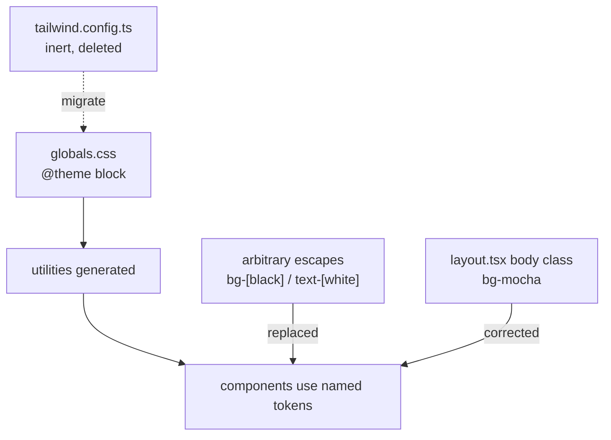

# Design Token Restoration — Design

## Overview

Move the palette from an inert JavaScript config into a `@theme` block in `globals.css`, then remove the workarounds that existed because the palette never worked.

## Why native `@theme` over a `@config` directive

Two options close the gap. Adding `@config "../../tailwind.config.ts"` to `globals.css` is a one-line fix that keeps the existing file working. Migrating to `@theme` is a larger diff.

`@theme` is the choice here because the tokens end up next to the CSS variables already living in `globals.css`, which removes the split-brain problem the earlier fix plan identified as "design token fragmentation" — one file for tokens, another for variables, with no clear precedence. It is also the direction Tailwind v4 documents as primary, with JavaScript configs described as backward compatibility.

The cost is that the steering rule pointing at `tailwind.config.ts` has to be updated. That is covered in Requirement 4 and was approved.

## Namespace mapping

Tailwind v4 derives utilities from theme variable namespaces. The existing config translates as:

| Config key | Theme variable | Generates |
|---|---|---|
| `colors.navy` | `--color-navy` | `bg-navy`, `text-navy`, `border-navy` |
| `colors.neutral.500` | `--color-neutral-500` | `bg-neutral-500` etc. |
| `fontFamily.serif` | `--font-serif` | `font-serif` |
| `boxShadow.soft` | `--shadow-soft` | `shadow-soft` |
| `borderRadius.xl` | `--radius-xl` | `rounded-xl` |
| `maxWidth.content` | `--container-content` | `max-w-content` |

`maxWidth` mapping to `--container-*` is the non-obvious one — in v4 that namespace drives both container query variants and `max-w-*` sizing utilities.

Semantic groups with sub-keys flatten. `accent: { DEFAULT, foreground, hover }` becomes `--color-accent`, `--color-accent-foreground`, `--color-accent-hover`, producing `bg-accent`, `text-accent-foreground`, `hover:bg-accent-hover`.

Overriding `--radius-xl` replaces Tailwind's built-in `rounded-xl` value (0.75rem) with 1rem, matching the current config's intent.

## What stays in `:root`

`globals.css` currently defines several variables in `:root`. After the migration:

| Variable | Destination | Reason |
|---|---|---|
| `--color-background`, `--color-foreground`, `--color-accent` | `@theme` | Should generate `bg-background` etc. |
| `--font-serif`, `--font-sans`, `--font-mono` | `@theme` | Should generate `font-*`, and must resolve through the theme rather than an incidental cascade override |
| `--background`, `--foreground` | `:root` | Consumed directly by the `body` rule; no utility needed |
| `--accent`, `--accent-hover` | `:root` | Consumed by the `.eyebrow` utility class |
| `color-scheme: light` | `:root` | Not a token |
| `--neutral-50`, `--neutral-100`, `--neutral-900` | Removed | Duplicates of the theme ramp, unreferenced |

The `body` rule keeps its explicit `background-color` and `color`. It is currently the only reason the page renders on the right background at all, since `bg-mocha` on `<body>` produces nothing. Once tokens work, `bg-mocha` will apply — and it is warm near-black, which would override the linen background the design intends. So `layout.tsx` needs its body class corrected as part of this work, not just the token definitions. This is the one place where making tokens work *changes* rendering rather than restoring it, and it is easy to miss.

## Architecture

## Components and Interfaces

### `src/app/globals.css`

Gains a `@theme` block after the import, carrying the full palette, the three font families, `--shadow-soft`, `--container-content: 80rem`, and `--radius-xl: 1rem`. The `:root` block is trimmed to the variables above.

### `tailwind.config.ts`

Deleted. `postcss.config.mjs` needs no change — it already loads only `@tailwindcss/postcss`, with no reference to the config file.

### Component audit

Every arbitrary `[black]` / `[white]` escape is replaced with the token that expresses the intent. The mapping is not mechanical, because several escapes were applied to *dark* surfaces where `black` was standing in for a light token:

- `sections/PropertyCategories.tsx` — `bg-[black]` section with `text-[white]` headings, but cards are `bg-[white]` with `text-[black]` bodies. The section is a dark band; `bg-onyx` with light text on the band and `bg-linen` cards with `text-navy` bodies preserves the intent.
- `sections/ValueProposition.tsx` — same dark-band pattern, plus `text-[black]` used for an *accent* eyebrow on a dark background, which is currently invisible. That one becomes `text-champagne`.
- `layout/Navigation.tsx` — the worst case. `bg-[black]` dropdown panels containing `text-[black]` items, so the menu text is black on black. Also uses `text-[black]` as the active-link colour over a dark hero. Active state becomes `text-champagne`, panel becomes `bg-navy`, items become light.
- `ui/Input.tsx`, `ui/Textarea.tsx`, `forms/FormNavigation.tsx` — light form surfaces. `bg-[white]` → `bg-linen` or `bg-white`, `text-[black]` → `text-navy`, borders and placeholders to `navy` at reduced opacity.
- `(marketing)/privacy`, `terms`, `buy-home`, `sell-home`, `get-started` — light content pages using `bg-[white]` / `text-[black]` / `text-[black]/70`. These become `bg-linen` / `text-navy` / `text-stone`.

Contrast is checked for each changed pair against WCAG AA — 4.5:1 for body text, 3:1 for large text. The palette supports this: `navy` (#1C2A39) on `linen` (#FAF9F6) is roughly 13:1, and `stone` (#707070) on `linen` is roughly 4.9:1, both passing for body text. `champagne` (#C5A059) on `navy` is roughly 5.4:1. `cerulean` (#0A7EA4) on white is roughly 4.6:1, which passes for body text but only just — worth noting for any future use on tinted backgrounds.

### Error boundaries

`src/app/error.tsx` is renamed to `src/app/global-error.tsx`. It already renders `<html>`/`<body>` and is already named `GlobalError`, so the file was simply in the wrong place.

A new `src/app/error.tsx` handles in-layout errors without a document shell, styled with working tokens.

**Next 16 recovery prop.** The shipped docs at `node_modules/next/dist/docs/01-app/03-api-reference/03-file-conventions/error.md` show that `unstable_retry` was added in v16.2.0 and is now the recommended recovery prop: "In most cases, you should use `unstable_retry()` instead" of `reset()`. The distinction is real — `unstable_retry()` re-fetches and re-renders the boundary's children, while `reset()` only clears error state and re-renders without re-fetching. For a data-driven page a bare `reset()` will often re-render straight back into the same error.

The current `error.tsx` uses `reset`. Both boundaries take `unstable_retry` as the primary action. The `unstable_` prefix signals the API may change, so the prop is destructured in one place per file to keep any future rename to a single edit.

## Testing Strategy

This spec is primarily visual, so verification is mostly observational — but two things are checkable mechanically:

- A build assertion that generated CSS contains the custom utilities. Compiling `globals.css` plus a fixture using `bg-navy`, `text-cerulean`, `shadow-soft`, and `max-w-content`, then asserting the output includes the expected declarations, catches a namespace mistake directly. This is the check that would have caught the original bug.
- A repository grep asserting no `[black]` or `[white]` arbitrary colour escape remains in `src/`, satisfying Requirement 2.5 as a regression guard.

Manual verification covers the rest: a scratch route rendering each token during Task 1 (deleted before the task closes), then before-and-after comparison on the nav dropdown, `/privacy`, `/terms`, and `/buy-home`, plus a thrown error to confirm the boundary renders with a single document.

## Note on the superseded fix plan

`quiet-luxury-visual-fix-plan.md` at the repo root describes tasks 1 and 2 as adding these tokens to `tailwind.config.ts` and updating `globals.css` variables. Those steps were carried out and did not work, because the root cause was config detection rather than missing tokens. The file is left in place — pruning root documentation is out of scope — but this design supersedes it, and anyone reading it should know the diagnosis in it is incorrect.
