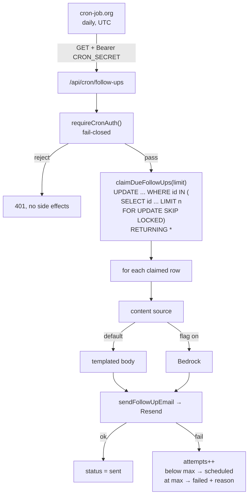

# Follow-Up Automation Reliability — Design

## Overview

Four changes, in rough order of risk they retire: authenticate the endpoint, make sending idempotent, make failure recoverable, and give the whole thing a schedule that actually fires. Content generation is swapped from AI to templates behind an abstraction, which is what removes Bedrock from the critical path.

## Why templated content simplifies everything else

The current loop awaits a Bedrock call, a Resend call, and a 500 ms sleep per row. That is seconds per item against a serverless function limit, which is the real reason the timeout risk exists.

Removing the LLM call leaves one Resend request per row. The 500 ms sleep was there to avoid rate-limiting an LLM endpoint and is no longer needed. The result is fast enough that a bounded batch comfortably fits the time limit at MVP volume — so the batch cap becomes a safety rail rather than a constant constraint.

## Architecture



The claim is the load-bearing piece. A single `UPDATE ... RETURNING *` is atomic in Postgres, so two concurrent runs cannot both claim the same row — the second finds nothing matching and returns an empty set, and no explicit transaction is needed.

Two details of the statement are not optional, contrary to an earlier draft of this design which claimed the claim was "simpler and cheaper than `SELECT ... FOR UPDATE SKIP LOCKED`". The shipped claim uses `FOR UPDATE SKIP LOCKED`, and has to:

- **Postgres has no `LIMIT` on `UPDATE`.** Bounding the batch (Requirement 4.4) therefore needs the ids chosen by an inner `SELECT ... ORDER BY scheduled_for LIMIT n`, and the `UPDATE` matches `WHERE id IN (...)`. There is no single-clause form of this.
- **Without `SKIP LOCKED` a concurrent run blocks rather than skipping.** The inner select takes row locks; a second run whose candidate set overlaps waits for the first run's transaction instead of moving on to different work. `SKIP LOCKED` is what turns contention into disjoint batches, which is the behaviour the concurrency test asserts.

So the shape is an `UPDATE` over an id subquery that locks and skips, not a bare predicate.

## Data Models

`follow_ups` gains two things:

| Change | Purpose |
|---|---|
| `'sending'` added to `follow_up_status` enum | Distinguishes claimed-and-in-progress from scheduled and sent |
| `attempts` integer, default 0 | Drives bounded retry |

Adding a value to a Postgres enum is additive and safe. Existing rows are unaffected.

**Stranded-row recovery (Requirement 5.5).** If a run claims rows and then the function is killed, those rows sit in `'sending'` forever. The recovery is a staleness reclaim: rows in `'sending'` whose `updatedAt` is older than a threshold are eligible to be claimed again. The claim predicate becomes:

```sql
WHERE (status = 'scheduled' AND scheduled_for <= now)
   OR (status = 'sending'   AND updated_at < now - interval '15 minutes')
```

The threshold has to exceed the maximum plausible function duration, or a run could reclaim rows another live run is still working. Fifteen minutes is comfortably beyond any serverless limit.

## Components and Interfaces

### `src/lib/services/follow-up-content.ts` (new)

```ts
export type FollowUpType = 'immediate' | 'day3' | 'day7' | 'day14' | 'day30' | 'pastClient60';

export interface FollowUpContent { subject: string; body: string; }
export interface FollowUpContentSource {
  readonly name: 'template' | 'ai';
  generate(lead: Lead, type: FollowUpType): Promise<FollowUpContent>;
}

export const templateContentSource: FollowUpContentSource;
export const aiContentSource: FollowUpContentSource;
export function getContentSource(): FollowUpContentSource;
```

`getContentSource` returns the AI source only when an explicit env flag is set, defaulting to templates (Requirements 2.2, 2.3). The AI source wraps the existing Bedrock path so nothing is thrown away.

Template content honours Requirement 1.4 by not claiming history that does not exist. The current `day3` prompt asks the model to reference "previous conversations" while `previousMessage` is hardcoded to `'N/A'` — the templates say something honest instead, like offering a buyer's guide, rather than pretending to recall a conversation.

Requirement 1.5, the nameless-lead case: today `api/cron/follow-ups/route.ts:88-91` falls back to the literal `'there'`, which produces "Hey there!" as a greeting — that reads fine — but the same value also lands mid-sentence in subject lines like `Quick check-in, ${lead.name}` producing "Quick check-in, there". Templates take a resolved greeting and a separate optional name, so subjects drop the name entirely when it is absent.

### `src/lib/services/follow-up-scheduler.ts` (modified)

`sendFollowUp` takes content from the source rather than calling Bedrock directly. Removed: the unused `lines` variable (line 109), `calculateFollowUpSchedule`, and `processPendingFollowUps` — all dead, and the last two disagree with the live route logic (Requirement 2.6).

It returns a result object rather than a boolean, so the caller can distinguish failure kinds and record a real reason (Requirement 5.4):

```ts
type SendResult = { ok: true } | { ok: false; reason: string };
```

The current boolean return is precisely why `failureReason` is the generic `'Send failed'`.

### `src/lib/db/follow-up-queue.ts` (new)

Isolates the queue's SQL so it can be tested and reasoned about separately from the route:

```ts
export async function claimDueFollowUps(limit: number, now: Date): Promise<FollowUpRow[]>;
export async function markSent(id: string, now: Date): Promise<void>;
export async function recordFailure(id: string, reason: string, attempts: number, now: Date): Promise<FailureOutcome>;
export async function abandon(id: string, reason: string, now: Date): Promise<FailureOutcome>;
export async function countQueueBacklog(now: Date): Promise<{ due: number; stranded: number }>;
```

`recordFailure` decides between requeue and permanent failure based on the attempt count, keeping that policy in one place, and returns which it chose so the route can report requeued and failed separately.

`abandon` covers failures no retry can fix — principally a follow-up whose lead has been deleted (Requirement 4.6). Expressing that through `recordFailure` means passing an attempt count high enough to exceed the budget, which produces the right status and a meaningless number in the `attempts` column. A separate function keeps the stored data truthful.

`countQueueBacklog` reports two figures rather than one. `due` counts `scheduled`-and-due rows, so it keeps the plain meaning "waiting to be picked up". Rows stranded in `sending` by a killed run are claimable too, once past the staleness threshold, but they indicate a crashed run rather than routine backlog, so they are reported separately instead of being blended into `due`. Rows in `sending` that are still fresh belong to a live run and are counted in neither.

**What `attempts` counts.** Every delivery attempt, including a successful one — `markSent` increments it as well, so a row that sent first time reads 1. That makes a double-send visible in the data (`attempts = 2` on a `sent` row is unreachable by any legitimate path). It does not shorten the retry budget: `sent` is terminal, so `recordFailure` never reads a value a success contributed to, and `MAX_SEND_ATTEMPTS` still buys a full three failures.

### `src/lib/services/lead-mapping.ts` (new)

Fixes the unchecked casts (Requirement 4.7). Lines 99 and 103 of the cron route currently lie to the type system: `'general'` is asserted into a union that does not contain it, and a ten-value database enum is asserted into a six-value TypeScript union.

```ts
export function toSchedulerLead(row: DbLead): Lead;
```

It normalises `propertyInterest` to a member of the intent union with a documented default, and maps the database status enum onto the scheduler union explicitly. Where the two vocabularies genuinely do not correspond, the mapping is stated in code rather than asserted away.

### Cron routes (modified)

`src/lib/api/cron-auth.ts` centralises the check so both routes share one policy (Requirement 3.6):

```ts
export function requireCronAuth(request: NextRequest): NextResponse | null;
```

It returns 401 when the header is absent, when it does not match, or when `CRON_SECRET` is unset — the fail-open `if (cronSecret && ...)` becomes fail-closed. `CRON_SECRET` was added to the env schema in Spec 2; here it becomes required at request time.

`daily-summary` replaces its hardcoded `[]` with a real query over the previous day's leads, and the commented-out Prisma example is deleted.

Stale doc comments go: the `netlify.toml` block at `follow-ups/route.ts:16-18` that was never valid for a Next route handler, and the `vercel.json` guidance at `daily-summary/route.ts:11-16`. Each is replaced by the cron-job.org trigger the route actually expects — URL, method, header form, and schedule — so the mechanism is described where a reader of the handler will see it.

### Scheduling

`vercel.json` is deleted. It declared both crons as `0 7 * * *`, and Netlify ignores the file entirely — so it never scheduled anything, and it advertised a platform the project does not deploy to. Its only effect was to make a reader believe a schedule existed.

**Netlify scheduled functions cannot replace it.** They only target functions in the Netlify functions directory, and Netlify's documentation states they cannot be invoked by URL — so they cannot drive a Next.js App Router route handler, which is what both cron endpoints are. An adapter function that internally fetched the route would work, but it adds a deployment artefact and a layer of indirection for no gain over an external caller hitting the URL directly.

The schedule therefore lives at cron-job.org, hitting the endpoints with the bearer secret, which is what the project handoff always specified. Configuration is documented here rather than in a new root markdown file — `HANDOFF.md` carries an operator-facing copy, since that is the document a new developer is told to read first.

**Job 1 — follow-up drip**

| Setting | Value |
|---|---|
| URL | `https://gowithjoeyo.netlify.app/api/cron/follow-ups` |
| Method | `GET` |
| Header | `Authorization: Bearer <CRON_SECRET>` |
| Schedule | `0 11 * * *` UTC |

**Job 2 — daily lead digest**

| Setting | Value |
|---|---|
| URL | `https://gowithjoeyo.netlify.app/api/cron/daily-summary` |
| Method | `GET` |
| Header | `Authorization: Bearer <CRON_SECRET>` |
| Schedule | `30 11 * * *` UTC |

The header value is the `CRON_SECRET` set in Netlify. It is entered in the cron-job.org UI and appears in no tracked file — the repository is secret-scanned on every build, and a real value committed anywhere fails the build and forces a rotation.

`0 11 * * *` UTC is 7 AM Eastern during daylight saving and 6 AM during standard time. **The trigger is a fixed UTC instant, so the local hour it lands at moves by one across each DST boundary.** That drift is expected behaviour, not a fault to be diagnosed later. A UTC cron cannot track a DST-shifting local hour, and accepting an hour of winter drift is a large improvement on the deleted `0 7 * * *`, which would have fired at 2–3 AM local.

The digest job is offset by 30 minutes so the two runs do not contend for the same function capacity.

**The trigger time and the reporting window are separate concerns.** The digest's *trigger* is UTC, as above. The *window it reports on* is anchored to `America/New_York` in `src/lib/utils/report-day.ts`, so "yesterday" means the calendar day Joey lived, computed from the zone's real DST rules rather than from a fixed offset. Shifting the cron expression changes when the mail arrives; it does not change which leads the mail covers.

## Error Handling

| Failure | Handling |
|---|---|
| Missing/wrong/unset cron secret | 401 before any work |
| Lead row missing for a follow-up | Row marked failed with reason, loop continues |
| Content generation fails | Counts as a send failure, enters retry policy |
| Resend send fails | Attempts incremented, requeued or failed at max |
| Run killed mid-flight | Claimed rows reclaimed after the staleness threshold |
| Batch cap reached | Response reports remaining work |

## Testing Strategy

The concurrency property is the one worth the most care. The test runs two claim-and-process passes against the same seeded due rows with a mocked database and asserts exactly one send per row — mirroring two overlapping cron triggers.

Other coverage:

- Templates: a snapshot per touchpoint, a nameless lead producing a natural greeting and a name-free subject, and an escaped injection payload
- Content source: templates by default with no Bedrock call, AI source when the flag is set
- Cron auth: absent header, wrong secret, correct secret, unset `CRON_SECRET` — each asserting no send occurred on rejection
- Retry: transient failure requeues with incremented attempts; reaching the maximum marks failed with a real reason; and a row walked run by run through its whole life — fail, requeue, fail, requeue, fail, abandoned — since the endpoints passing individually does not prove a requeued row is ever claimed again
- Stranded rows: a `'sending'` row older than the threshold is reclaimed; a fresh one is not
- Lead mapping: an out-of-union `propertyInterest` normalises rather than corrupting the type; each database status maps deliberately
- Daily summary: seeded leads appear; a genuinely empty day reports accurately

## Operational note

`CRON_SECRET` must be set in Netlify before this spec deploys, followed by a redeploy. Until it is set the endpoint returns 401 to everything, including a legitimate scheduler — that is the intended fail-closed behaviour, and it is the direct inversion of today's fail-open bug.
