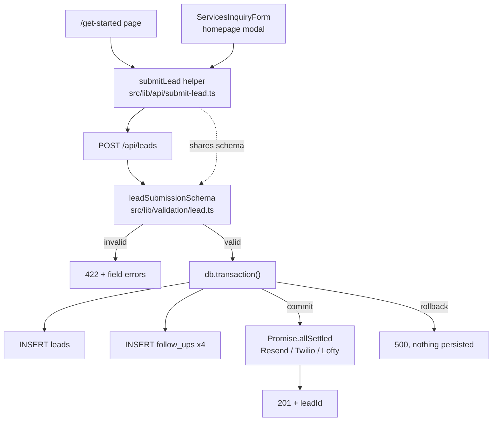

# Lead Capture Pipeline — Design

## Overview

Four layers change, bottom-up: test tooling, a shared validation schema, an atomic write in the route, and the two client forms. The schema is the pivot — it is authored once and consumed by both the route handler and the client, which is what stops server and client validation from drifting.

## Architecture



The integration fan-out sits deliberately outside the transaction. A Resend outage should not discard a captured lead.

## Components and Interfaces

### `src/lib/validation/lead.ts` (new)

Single source of truth for lead shape.

Exports `LEAD_INTENTS`, `LEAD_FIELD_LIMITS`, `leadSubmissionSchema`, `LeadSubmissionInput`, `LeadSubmission`, and `formatFieldErrors`.

Length caps live in `LEAD_FIELD_LIMITS` and are derived from the column widths in `src/lib/db/schema.ts`: `email` varchar(255), `phone` varchar(20), `fullName` varchar(200), `firstName`/`lastName` varchar(100), `timeline` varchar(50), `propertyInterest` varchar(100). Rejecting at the schema converts an opaque Postgres `22001` into a labelled 422.

`additionalNotes` gets a 2000-char cap. The column is `text` so Postgres accepts more, but the field is interpolated into AI prompts and emails, and an unbounded free-text field is an injection and cost surface.

#### Resolving the intent vocabulary

Reading the forms revealed **three** competing intent vocabularies plus a fourth combination offered to users:

| Source | Values |
|---|---|
| `LeadIntent` enum, `src/types/lead.ts` | buy, sell, invest, insurance, closing, general |
| `Lead['intent']`, `follow-up-scheduler.ts:14` | buy, sell, insurance, closing |
| `ServiceType`, `ServicesInquiryForm.tsx:19` | buying, selling, both, general |
| `formFields`, `src/config/form-fields.ts:44` | buy, sell, insurance, closing, general |

The schema adopts the `LeadIntent` values as canonical. That enum is the repository's declared type system and is a superset of the others, so reusing it avoids inventing a fifth vocabulary. This also explains the unchecked cast at `api/cron/follow-ups/route.ts:99`, which asserts `'general'` into the four-value union — a value the UI genuinely offers and the union genuinely lacks. Spec 4 Task 4 fixes the receiving end.

Forms translate their own vocabulary before submitting; the schema does not absorb it. A test asserts `'buying'`, `'selling'`, and `'both'` are rejected, so the canonical set cannot quietly drift back to three.

`source` is deliberately **not** in the schema. The DB `leadSourceEnum` (`website_form`, `sms_inbound`, …) and the `LeadSource` type enum (`website`, `facebook`, …) are yet another mismatched pair, and both forms are website forms, so the route continues to set `'website_form'` directly rather than translating a fourth vocabulary for no gain.

#### Name normalisation

The route previously took a single `name` and split it on whitespace. `LeadCaptureForm` already collects `firstName` and `lastName` separately, so that split was discarding better data.

The schema accepts either shape. A preprocess step synthesises `name` from the parts when only the parts are supplied, then `name` is validated as an ordinary required field and the transform emits all three values the database stores. Explicit `firstName`/`lastName` win over anything derived from splitting.

The preprocess placement is deliberate. The name rule was first written as a cross-field `superRefine`, but Zod skips refinements when the base object already has errors — so a submission with a bad email *and* no name reported only the email, and the visitor discovered the missing name on a second submit. As a preprocess plus a required field, all problems surface in one pass. A regression test covers this.

#### Tolerant shapes

`PropertyRequest` in `src/types/property.ts` declares `propertyType` and `preferredLocations` as `string[]`, while `src/config/form-fields.ts` binds both to single text inputs that produce a plain string — so the runtime value is either shape depending on which form submitted. Those fields accept both and normalise to a comma-joined value, with the length cap applied after joining.

Blank optional strings normalise to absent rather than being stored as empty strings, since uncontrolled inputs submit `''` for every skipped field. Because `exactOptionalPropertyTypes` is enabled, the transform omits absent keys entirely instead of setting them to `undefined`; a test asserts this.

`timeline` and `budget` stay free text rather than closed enums. The two forms use different timeline vocabularies, both columns are varchars, and rejecting a submission over a low-stakes preference field would cost a lead for no benefit.

### `src/lib/api/submit-lead.ts` (new)

Shared client helper so both forms issue an identical request and interpret the response identically.

```ts
type SubmitLeadResult =
  | { ok: true; leadId: string }
  | { ok: false; fieldErrors: Record<string, string>; message?: never }
  | { ok: false; message: string; fieldErrors?: never };

export async function submitLead(input: unknown): Promise<SubmitLeadResult>;
```

Returning a discriminated union rather than throwing keeps the calling components straightforward: a 422 becomes `fieldErrors`, anything else becomes a single `message`.

### `src/app/api/leads/route.ts` (modified)

Replaces the truthiness check with `leadSubmissionSchema.safeParse(body)`, returns 422 with `formatFieldErrors` output on failure, and moves both inserts inside `db.transaction()`.

Response contract:

| Condition | Status | Body |
|---|---|---|
| Valid, persisted | 201 | `{ success, leadId, message, integrations }` |
| Schema rejection | 422 | `{ error: 'Validation failed', fieldErrors }` |
| Malformed JSON | 400 | `{ error }` |
| Transaction or unexpected failure | 500 | `{ error }` |

The existing 201 shape is preserved so the dashboard and any external consumer keep working.

### `src/lib/db/schema.ts` (modified)

Indexes added via Drizzle's third table callback argument:

| Table | Index | Rationale |
|---|---|---|
| `follow_ups` | `(status, scheduled_for)` | The cron's only query — `api/cron/follow-ups/route.ts:36-44` |
| `follow_ups` | `(lead_id)` | FK child column, not auto-indexed; also the cascade path |
| `leads` | `(email)` non-unique | Lookup by email |
| `leads` | `(created_at)` | Dashboard ordering, `api/dashboard/data/route.ts:27` |
| `conversations` | `(lead_id)` | FK child column |
| `analytics_events` | `(lead_id)` | FK child column |

No unique constraint on `leads.email`. A repeat client legitimately submits twice — buy now, sell in three years — and a unique index would turn the second inquiry into a 500. The duplicate-from-retry problem this might appear to solve is actually caused by the partial write, which the transaction fixes.

## Data Models

No column changes in this spec. `follow_ups` gains columns in Spec 4 (`sending` state, attempt counter).

## Error Handling

| Failure | Handling | Visible to |
|---|---|---|
| Malformed JSON body | 400, caught at `request.json()` | Client message |
| Schema rejection | 422 with per-field errors | Field-level UI |
| Transaction failure | Rollback, 500, logged | Client message, server logs |
| Integration failure (Resend/Twilio/Lofty) | Captured by `Promise.allSettled`, reported in the `integrations` block, lead retained | Server logs |

The response deliberately still returns 201 when integrations fail, because the lead is safely stored — that is the outcome the visitor cares about. The `integrations` flags carry the detail for logs.

## Testing Strategy

Vitest with the `node` environment for schema and route-handler tests. Route handlers are tested by importing the exported `POST` directly and passing a constructed `NextRequest`, with `@/lib/db` mocked via `vi.mock` — no live database needed.

`vitest.config.ts` maps the `@/` alias to `./src` to match `tsconfig.json` paths.

Coverage targets for this spec:

- Schema: valid payload, malformed email, missing intent, out-of-enum intent, empty name, each length boundary
- Route: 201 happy path, 422 per rejection case, 400 on malformed JSON, 500 on transaction failure with no orphan row
- Client helper: 201 → `ok: true`, 422 → `fieldErrors`, network failure → `message`

Component tests for the two forms use `jsdom`. Because Vitest needs different environments per test type, environment is selected per file via a docblock comment rather than globally.

## Notes on repo constraints

- `tsconfig.json` sets `exactOptionalPropertyTypes: true` and `noUncheckedIndexedAccess: true`. Optional properties cannot be assigned `undefined` explicitly — the existing codebase works around this with the `...(x ? { k: x } : {})` spread pattern (see `api/cron/follow-ups/route.ts:95`). New code follows the same pattern.
- Drizzle runs on `drizzle-orm/neon-serverless` with a WebSocket `Pool` (`src/lib/db/index.ts:19-32`), which supports transactions. The HTTP driver would not.
- `/drizzle` is gitignored and only `db:push` is used, so index additions are applied by push with no migration file to review.
