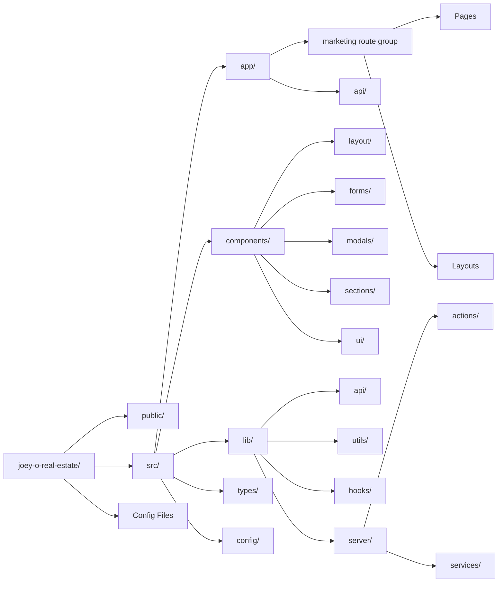
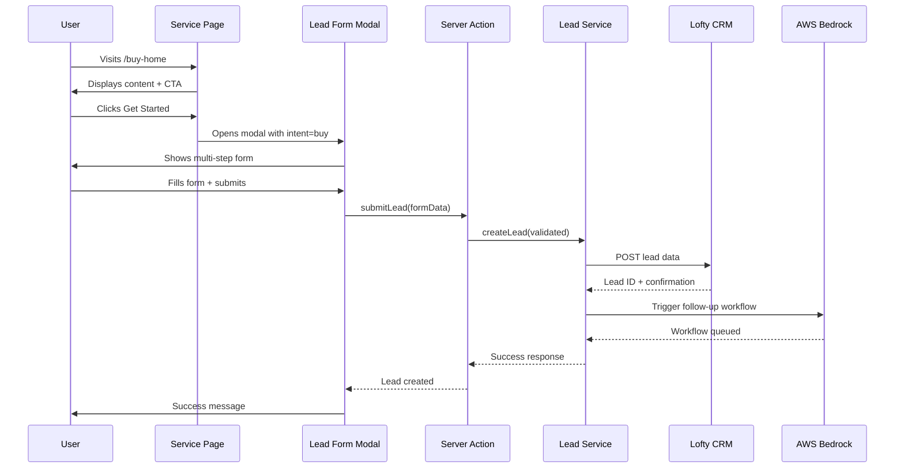

# Next.js Real Estate Lead-Generation Platform
## Directory Structure & Routing Architecture

**Project:** Joey O. Real Estate Lead-Generation Ecosystem  
**Framework:** Next.js 14+ (App Router)  
**Tech Stack:** TypeScript, Tailwind CSS, AWS Serverless  
**Focus:** MVP-first, scalable, conversion-optimized

---

## Table of Contents

1. [Complete Directory Structure](#complete-directory-structure)
2. [Routing Strategy](#routing-strategy)
3. [Directory Organization Explained](#directory-organization-explained)
4. [Naming Conventions](#naming-conventions)
5. [Architectural Decisions & Rationale](#architectural-decisions--rationale)
6. [File Organization Patterns](#file-organization-patterns)
7. [MVP vs Post-MVP Scope](#mvp-vs-post-mvp-scope)

---

## Complete Directory Structure

```
joey-o-real-estate/
├── .github/
│   └── workflows/
│       └── ci.yml                    # CI/CD pipeline configuration
├── .vscode/
│   └── settings.json                 # VSCode workspace settings
├── public/
│   ├── images/
│   │   ├── hero/                     # Homepage hero images
│   │   ├── services/                 # Service page imagery
│   │   ├── testimonials/             # Client testimonial photos
│   │   └── brand/                    # Logo, favicon, og-images
│   ├── fonts/                        # Custom web fonts (if any)
│   └── robots.txt                    # SEO crawler instructions
├── src/
│   ├── app/
│   │   ├── (marketing)/              # Route group: public-facing pages
│   │   │   ├── layout.tsx            # Marketing layout (header, footer)
│   │   │   ├── page.tsx              # Homepage (/)
│   │   │   ├── about/
│   │   │   │   └── page.tsx          # About page (/about)
│   │   │   ├── buy-home/
│   │   │   │   ├── page.tsx          # Buy home intent page (/buy-home)
│   │   │   │   └── metadata.ts       # SEO metadata config
│   │   │   ├── sell-home/
│   │   │   │   ├── page.tsx          # Sell home intent page (/sell-home)
│   │   │   │   └── metadata.ts       # SEO metadata config
│   │   │   ├── home-insurance/
│   │   │   │   ├── page.tsx          # Home insurance page (/home-insurance)
│   │   │   │   └── metadata.ts       # SEO metadata config
│   │   │   ├── closing-services/
│   │   │   │   ├── page.tsx          # Closing attorney page (/closing-services)
│   │   │   │   └── metadata.ts       # SEO metadata config
│   │   │   ├── contact/
│   │   │   │   └── page.tsx          # Contact page (/contact)
│   │   │   └── get-started/
│   │   │       └── page.tsx          # Get started CTA page (/get-started)
│   │   ├── api/
│   │   │   ├── leads/
│   │   │   │   └── route.ts          # POST /api/leads - Lead capture endpoint
│   │   │   ├── lofty/
│   │   │   │   ├── webhook/
│   │   │   │   │   └── route.ts      # POST /api/lofty/webhook - Lofty CRM webhooks
│   │   │   │   └── sync/
│   │   │   │       └── route.ts      # POST /api/lofty/sync - Manual sync trigger
│   │   │   ├── ai/
│   │   │   │   ├── chat/
│   │   │   │   │   └── route.ts      # POST /api/ai/chat - AI assistant endpoint
│   │   │   │   └── follow-up/
│   │   │   │       └── route.ts      # POST /api/ai/follow-up - Automated follow-up
│   │   │   └── analytics/
│   │   │       └── route.ts          # POST /api/analytics - Custom event tracking
│   │   ├── layout.tsx                # Root layout (global providers, fonts)
│   │   ├── not-found.tsx             # 404 page
│   │   ├── error.tsx                 # Error boundary
│   │   └── globals.css               # Global styles, Tailwind imports
│   ├── components/
│   │   ├── layout/
│   │   │   ├── Header.tsx            # Site header with navigation
│   │   │   ├── Footer.tsx            # Site footer
│   │   │   ├── Navigation.tsx        # Main navigation component
│   │   │   └── MobileMenu.tsx        # Mobile navigation drawer
│   │   ├── forms/
│   │   │   ├── LeadCaptureForm.tsx   # Multi-step lead capture form
│   │   │   ├── ContactForm.tsx       # Simple contact form
│   │   │   ├── FormStep.tsx          # Reusable form step wrapper
│   │   │   ├── FormProgress.tsx      # Progress indicator for multi-step
│   │   │   └── FormField.tsx         # Reusable form field component
│   │   ├── modals/
│   │   │   ├── LeadFormModal.tsx     # Modal wrapper for lead forms
│   │   │   ├── ModalProvider.tsx     # Modal context provider
│   │   │   └── ModalTrigger.tsx      # CTA button that opens modal
│   │   ├── sections/
│   │   │   ├── Hero.tsx              # Homepage hero section
│   │   │   ├── Services.tsx          # Services overview section
│   │   │   ├── Testimonials.tsx      # Client testimonials section
│   │   │   ├── CTA.tsx               # Call-to-action section
│   │   │   └── Stats.tsx             # Statistics/social proof section
│   │   ├── ui/
│   │   │   ├── Button.tsx            # Reusable button component
│   │   │   ├── Card.tsx              # Card component
│   │   │   ├── Input.tsx             # Form input component
│   │   │   ├── Select.tsx            # Select dropdown component
│   │   │   ├── Textarea.tsx          # Textarea component
│   │   │   ├── Badge.tsx             # Badge/tag component
│   │   │   └── Spinner.tsx           # Loading spinner
│   │   └── providers/
│   │       ├── Providers.tsx         # Root providers wrapper
│   │       └── AnalyticsProvider.tsx # Analytics tracking provider
│   ├── lib/
│   │   ├── api/
│   │   │   ├── lofty.ts              # Lofty CRM API client
│   │   │   ├── bedrock.ts            # AWS Bedrock AI client
│   │   │   └── analytics.ts          # Analytics helper functions
│   │   ├── utils/
│   │   │   ├── cn.ts                 # Tailwind class name merger (clsx + twMerge)
│   │   │   ├── validation.ts         # Form validation schemas (Zod)
│   │   │   ├── formatting.ts         # Phone, currency, date formatters
│   │   │   └── tracking.ts           # Event tracking utilities
│   │   ├── hooks/
│   │   │   ├── useLeadForm.ts        # Lead form state management hook
│   │   │   ├── useModal.ts           # Modal state management hook
│   │   │   ├── useTracking.ts        # Analytics tracking hook
│   │   │   └── useMediaQuery.ts      # Responsive breakpoint hook
│   │   ├── constants/
│   │   │   ├── routes.ts             # Route path constants
│   │   │   ├── forms.ts              # Form field configurations
│   │   │   └── tracking.ts           # Analytics event names
│   │   └── server/
│   │       ├── actions/
│   │       │   ├── lead-actions.ts   # Server actions for lead submission
│   │       │   └── contact-actions.ts # Server actions for contact form
│   │       └── services/
│   │           ├── lead-service.ts   # Lead processing business logic
│   │           ├── crm-service.ts    # CRM integration service
│   │           └── ai-service.ts     # AI assistant service
│   ├── types/
│   │   ├── index.ts                  # Barrel export for all types
│   │   ├── lead.ts                   # Lead-related type definitions
│   │   ├── form.ts                   # Form-related type definitions
│   │   ├── api.ts                    # API request/response types
│   │   └── crm.ts                    # Lofty CRM type definitions
│   ├── config/
│   │   ├── site.ts                   # Site-wide configuration
│   │   ├── seo.ts                    # SEO metadata configuration
│   │   ├── navigation.ts             # Navigation structure config
│   │   └── env.ts                    # Environment variable validation
│   └── styles/
│       └── theme.ts                  # Tailwind theme extensions
├── .env.local                        # Local environment variables (gitignored)
├── .env.example                      # Example environment variables
├── .eslintrc.json                    # ESLint configuration
├── .prettierrc                       # Prettier configuration
├── .gitignore                        # Git ignore rules
├── next.config.js                    # Next.js configuration
├── tailwind.config.ts                # Tailwind CSS configuration
├── tsconfig.json                     # TypeScript configuration
├── package.json                      # Dependencies and scripts
└── README.md                         # Project documentation
```

---

## Routing Strategy

### Public Routes (Marketing)

All public-facing pages are organized under the [`(marketing)`](src/app/(marketing)) route group, which applies a shared layout with header and footer.

| Route | File Path | Purpose | SEO Priority |
|-------|-----------|---------|--------------|
| `/` | [`app/(marketing)/page.tsx`](src/app/(marketing)/page.tsx) | Homepage - primary entry point | Critical |
| `/about` | [`app/(marketing)/about/page.tsx`](src/app/(marketing)/about/page.tsx) | About Joey O. - trust building | High |
| `/buy-home` | [`app/(marketing)/buy-home/page.tsx`](src/app/(marketing)/buy-home/page.tsx) | Buyer lead-intent page | Critical |
| `/sell-home` | [`app/(marketing)/sell-home/page.tsx`](src/app/(marketing)/sell-home/page.tsx) | Seller lead-intent page | Critical |
| `/home-insurance` | [`app/(marketing)/home-insurance/page.tsx`](src/app/(marketing)/home-insurance/page.tsx) | Home insurance lead-intent | High |
| `/closing-services` | [`app/(marketing)/closing-services/page.tsx`](src/app/(marketing)/closing-services/page.tsx) | Closing attorney lead-intent | High |
| `/contact` | [`app/(marketing)/contact/page.tsx`](src/app/(marketing)/contact/page.tsx) | General contact page | Medium |
| `/get-started` | [`app/(marketing)/get-started/page.tsx`](src/app/(marketing)/get-started/page.tsx) | Primary CTA landing page | High |

### API Routes

All backend endpoints are organized under [`/api`](src/app/api) with logical grouping by domain.

| Endpoint | Method | Purpose |
|----------|--------|---------|
| `/api/leads` | POST | Submit lead capture form data |
| `/api/lofty/webhook` | POST | Receive webhooks from Lofty CRM |
| `/api/lofty/sync` | POST | Manually trigger CRM sync |
| `/api/ai/chat` | POST | AI assistant chat endpoint |
| `/api/ai/follow-up` | POST | Trigger automated AI follow-up |
| `/api/analytics` | POST | Track custom analytics events |

### Route Groups Explained

**`(marketing)` Route Group:**
- Parentheses create a route group that doesn't affect the URL structure
- Allows shared [`layout.tsx`](src/app/(marketing)/layout.tsx) for all public pages
- Keeps marketing pages separate from potential future admin/dashboard routes
- Makes it easy to apply marketing-specific middleware or layouts

---

## Directory Organization Explained

### `/src/app` - Next.js App Router

The [`app`](src/app) directory uses Next.js 14+ App Router conventions:

- **Route Groups:** [`(marketing)`](src/app/(marketing)) groups related routes with shared layouts
- **File Conventions:**
  - [`page.tsx`](src/app/(marketing)/page.tsx) - Route component (required for public routes)
  - [`layout.tsx`](src/app/layout.tsx) - Shared layout wrapper
  - [`error.tsx`](src/app/error.tsx) - Error boundary
  - [`not-found.tsx`](src/app/not-found.tsx) - 404 page
  - [`route.ts`](src/app/api/leads/route.ts) - API route handler
  - [`metadata.ts`](src/app/(marketing)/buy-home/metadata.ts) - SEO metadata (optional, can be in page.tsx)

### `/src/components` - React Components

Organized by **function and reusability**:

- **[`layout/`](src/components/layout)** - Site-wide layout components (Header, Footer, Navigation)
- **[`forms/`](src/components/forms)** - Form components (lead capture, contact forms)
- **[`modals/`](src/components/modals)** - Modal components for embedded lead forms
- **[`sections/`](src/components/sections)** - Page section components (Hero, Testimonials, CTA)
- **[`ui/`](src/components/ui)** - Reusable UI primitives (Button, Input, Card)
- **[`providers/`](src/components/providers)** - React context providers

**Rationale:** This structure scales well as the component library grows. UI primitives are separated from business logic components.

### `/src/lib` - Business Logic & Utilities

The [`lib`](src/lib) directory contains all non-component code:

- **[`api/`](src/lib/api)** - External API clients (Lofty CRM, AWS Bedrock)
- **[`utils/`](src/lib/utils)** - Pure utility functions (validation, formatting)
- **[`hooks/`](src/lib/hooks)** - Custom React hooks
- **[`constants/`](src/lib/constants)** - Application constants
- **[`server/`](src/lib/server)** - Server-only code
  - **[`actions/`](src/lib/server/actions)** - Next.js Server Actions
  - **[`services/`](src/lib/server/services)** - Business logic services

**Rationale:** Clear separation between client and server code. Server Actions provide type-safe form handling without API routes.

### `/src/types` - TypeScript Definitions

Centralized type definitions organized by domain:

- [`lead.ts`](src/types/lead.ts) - Lead data structures
- [`form.ts`](src/types/form.ts) - Form field types
- [`api.ts`](src/types/api.ts) - API request/response types
- [`crm.ts`](src/types/crm.ts) - Lofty CRM integration types
- [`index.ts`](src/types/index.ts) - Barrel export for easy imports

**Rationale:** Centralized types improve maintainability and enable type reuse across client and server.

### `/src/config` - Configuration Files

Application configuration separated from code:

- [`site.ts`](src/config/site.ts) - Site metadata (name, description, URLs)
- [`seo.ts`](src/config/seo.ts) - SEO defaults and metadata templates
- [`navigation.ts`](src/config/navigation.ts) - Navigation structure
- [`env.ts`](src/config/env.ts) - Environment variable validation (using Zod)

**Rationale:** Configuration as code enables type safety and makes updates easier without touching component code.

---

## Naming Conventions

### Files & Directories

| Type | Convention | Example |
|------|------------|---------|
| React Components | PascalCase | [`LeadCaptureForm.tsx`](src/components/forms/LeadCaptureForm.tsx) |
| Utilities/Helpers | kebab-case | [`lead-service.ts`](src/lib/server/services/lead-service.ts) |
| Types | kebab-case | [`lead.ts`](src/types/lead.ts) |
| Config Files | kebab-case | [`site.ts`](src/config/site.ts) |
| API Routes | kebab-case | [`route.ts`](src/app/api/leads/route.ts) |
| Directories | kebab-case | [`lead-capture/`](src/components/forms) |
| Route Groups | kebab-case in parens | [`(marketing)/`](src/app/(marketing)) |

### Code Conventions

**Components:**
```typescript
// PascalCase for component names
export function LeadCaptureForm() { }

// Named exports preferred for components
export { LeadCaptureForm }
```

**Utilities:**
```typescript
// camelCase for function names
export function formatPhoneNumber() { }

// Named exports for utilities
export { formatPhoneNumber, validateEmail }
```

**Types:**
```typescript
// PascalCase for type/interface names
export interface LeadFormData { }
export type LeadStatus = 'new' | 'contacted' | 'qualified'

// Use 'type' for unions/primitives, 'interface' for objects
```

**Constants:**
```typescript
// SCREAMING_SNAKE_CASE for true constants
export const API_BASE_URL = 'https://api.example.com'

// camelCase for configuration objects
export const siteConfig = { }
```

---

## Architectural Decisions & Rationale

### 1. App Router Over Pages Router

**Decision:** Use Next.js 14+ App Router exclusively

**Rationale:**
- **Server Components by default** - Better performance, smaller client bundles
- **Streaming & Suspense** - Progressive page loading for better UX
- **Server Actions** - Type-safe form handling without API routes
- **Improved SEO** - Better metadata API and automatic sitemap generation
- **Future-proof** - App Router is the future of Next.js

### 2. Route Groups for Organization

**Decision:** Use [`(marketing)`](src/app/(marketing)) route group for public pages

**Rationale:**
- **Shared layouts** - Apply header/footer to all marketing pages
- **Clean URLs** - Route groups don't affect URL structure
- **Scalability** - Easy to add [`(admin)`](src/app/(admin)) or [`(dashboard)`](src/app/(dashboard)) groups later
- **Separation of concerns** - Marketing vs application logic

### 3. Intent-Based Route Names

**Decision:** Use [`/buy-home`](src/app/(marketing)/buy-home/page.tsx), [`/sell-home`](src/app/(marketing)/sell-home/page.tsx) instead of [`/services/buying`](src/app/(marketing)/services/buying/page.tsx)

**Rationale:**
- **Shorter URLs** - Better for paid ads and social sharing
- **Clear intent** - URL matches user's mental model
- **SEO-friendly** - Keywords in URL path
- **Conversion-focused** - Direct path to action
- **Flexibility** - Not locked into `/services` hierarchy

### 4. Embedded Forms with Modals

**Decision:** Lead capture forms open in modals, not dedicated pages

**Rationale:**
- **Better conversion** - Users stay on the page they're interested in
- **Context preservation** - Form knows which service triggered it
- **Tracking simplicity** - Track form source via query params or context
- **UX consistency** - Smooth modal experience vs page navigation
- **Progressive enhancement** - Can fall back to [`/get-started`](src/app/(marketing)/get-started/page.tsx) if needed

### 5. API Routes for Backend Integration

**Decision:** Use Next.js API routes ([`/app/api/*`](src/app/api)) instead of separate Lambda functions

**Rationale:**
- **MVP speed** - Single codebase, faster development
- **Type safety** - Share types between frontend and backend
- **Simplified deployment** - One deployment target
- **Cost efficiency** - Vercel/Next.js hosting includes API routes
- **Easy migration** - Can extract to Lambda later if needed

### 6. Server Actions for Form Handling

**Decision:** Use Server Actions for form submissions alongside API routes

**Rationale:**
- **Progressive enhancement** - Forms work without JavaScript
- **Type safety** - End-to-end type safety from form to database
- **Simplified code** - No need to create API routes for every form
- **Better DX** - Co-locate form logic with form components
- **Modern pattern** - Leverages React Server Components

### 7. Colocation of Related Files

**Decision:** Keep [`metadata.ts`](src/app/(marketing)/buy-home/metadata.ts) files next to [`page.tsx`](src/app/(marketing)/buy-home/page.tsx) in route directories

**Rationale:**
- **Discoverability** - SEO config lives with the page it affects
- **Maintainability** - Easy to update metadata when updating page
- **Scalability** - Each page owns its SEO configuration
- **Type safety** - Metadata is type-checked by Next.js

### 8. Separation of Client and Server Code

**Decision:** Strict separation via [`lib/server/`](src/lib/server) directory

**Rationale:**
- **Security** - Prevents accidental client-side exposure of secrets
- **Bundle size** - Server code never shipped to client
- **Clear boundaries** - Explicit about what runs where
- **Type safety** - TypeScript enforces server-only imports

### 9. Configuration as Code

**Decision:** Centralize configuration in [`/src/config`](src/config) with TypeScript

**Rationale:**
- **Type safety** - Configuration is type-checked
- **Validation** - Environment variables validated at build time
- **Discoverability** - Single source of truth for config
- **Refactoring** - Easy to update site-wide settings

### 10. Component Organization by Function

**Decision:** Organize components by function ([`forms/`](src/components/forms), [`modals/`](src/components/modals)) not by page

**Rationale:**
- **Reusability** - Components can be used across multiple pages
- **Scalability** - Easy to find and update components
- **Atomic design** - UI primitives ([`ui/`](src/components/ui)) separate from composed components
- **Maintainability** - Related components grouped together

---

## File Organization Patterns

### Page Structure Pattern

Every route page follows this structure:

```typescript
// app/(marketing)/buy-home/page.tsx

import { Metadata } from 'next'
import { Hero } from '@/components/sections/Hero'
import { LeadFormModal } from '@/components/modals/LeadFormModal'

// SEO metadata (can also be in separate metadata.ts)
export const metadata: Metadata = {
  title: 'Buy Your Dream Home | Joey O. Real Estate',
  description: 'Expert guidance for home buyers...',
}

// Page component (Server Component by default)
export default function BuyHomePage() {
  return (
    <>
      <Hero 
        title="Find Your Dream Home"
        cta="Get Started"
      />
      {/* More sections */}
    </>
  )
}
```

### API Route Pattern

API routes follow REST conventions:

```typescript
// app/api/leads/route.ts

import { NextRequest, NextResponse } from 'next/server'
import { leadService } from '@/lib/server/services/lead-service'

// POST /api/leads
export async function POST(request: NextRequest) {
  try {
    const body = await request.json()
    const lead = await leadService.createLead(body)
    return NextResponse.json(lead, { status: 201 })
  } catch (error) {
    return NextResponse.json(
      { error: 'Failed to create lead' },
      { status: 500 }
    )
  }
}
```

### Server Action Pattern

Server Actions for form handling:

```typescript
// lib/server/actions/lead-actions.ts

'use server'

import { z } from 'zod'
import { leadService } from '@/lib/server/services/lead-service'

const leadSchema = z.object({
  name: z.string().min(2),
  email: z.string().email(),
  phone: z.string().min(10),
  intent: z.enum(['buy', 'sell', 'insurance', 'closing']),
})

export async function submitLead(formData: FormData) {
  const validated = leadSchema.parse({
    name: formData.get('name'),
    email: formData.get('email'),
    phone: formData.get('phone'),
    intent: formData.get('intent'),
  })

  return await leadService.createLead(validated)
}
```

### Component Pattern

Components follow a consistent structure:

```typescript
// components/forms/LeadCaptureForm.tsx

'use client'

import { useState } from 'react'
import { Button } from '@/components/ui/Button'
import { Input } from '@/components/ui/Input'
import { submitLead } from '@/lib/server/actions/lead-actions'

interface LeadCaptureFormProps {
  intent: 'buy' | 'sell' | 'insurance' | 'closing'
  onSuccess?: () => void
}

export function LeadCaptureForm({ intent, onSuccess }: LeadCaptureFormProps) {
  const [isSubmitting, setIsSubmitting] = useState(false)

  async function handleSubmit(formData: FormData) {
    setIsSubmitting(true)
    try {
      await submitLead(formData)
      onSuccess?.()
    } finally {
      setIsSubmitting(false)
    }
  }

  return (
    <form action={handleSubmit}>
      {/* Form fields */}
    </form>
  )
}
```

---

## MVP vs Post-MVP Scope

### MVP Directory Structure (Week 1-5)

The initial MVP will include only these directories and files:

**Essential Directories:**
- [`app/(marketing)/`](src/app/(marketing)) - All public pages
- [`app/api/leads/`](src/app/api/leads) - Lead capture endpoint
- [`app/api/lofty/`](src/app/api/lofty) - Lofty CRM integration
- [`components/layout/`](src/components/layout) - Header, Footer
- [`components/forms/`](src/components/forms) - Lead capture form
- [`components/modals/`](src/components/modals) - Form modal
- [`components/ui/`](src/components/ui) - Basic UI components
- [`lib/api/lofty.ts`](src/lib/api/lofty.ts) - CRM client
- [`lib/utils/validation.ts`](src/lib/utils/validation.ts) - Form validation
- [`lib/server/actions/`](src/lib/server/actions) - Form actions
- [`types/`](src/types) - Core type definitions
- [`config/`](src/config) - Site configuration

**MVP Pages:**
- Homepage ([`/`](src/app/(marketing)/page.tsx))
- About ([`/about`](src/app/(marketing)/about/page.tsx))
- Buy Home ([`/buy-home`](src/app/(marketing)/buy-home/page.tsx))
- Sell Home ([`/sell-home`](src/app/(marketing)/sell-home/page.tsx))
- Home Insurance ([`/home-insurance`](src/app/(marketing)/home-insurance/page.tsx))
- Closing Services ([`/closing-services`](src/app/(marketing)/closing-services/page.tsx))
- Contact ([`/contact`](src/app/(marketing)/contact/page.tsx))
- Get Started ([`/get-started`](src/app/(marketing)/get-started/page.tsx))

### Post-MVP Additions (Month 2-5)

**Advanced AI Features:**
- [`app/api/ai/chat/`](src/app/api/ai/chat) - AI chat endpoint
- [`app/api/ai/follow-up/`](src/app/api/ai/follow-up) - Automated follow-up
- [`lib/api/bedrock.ts`](src/lib/api/bedrock.ts) - AWS Bedrock client
- [`lib/server/services/ai-service.ts`](src/lib/server/services/ai-service.ts) - AI business logic

**Enhanced Analytics:**
- [`app/api/analytics/`](src/app/api/analytics) - Custom event tracking
- [`lib/api/analytics.ts`](src/lib/api/analytics.ts) - Analytics client
- [`components/providers/AnalyticsProvider.tsx`](src/components/providers/AnalyticsProvider.tsx) - Analytics context

**Additional Pages:**
- Blog/Resources section
- Testimonials page
- FAQ page
- Market insights pages

**Advanced Components:**
- [`components/sections/Testimonials.tsx`](src/components/sections/Testimonials.tsx) - Enhanced testimonials
- [`components/sections/Stats.tsx`](src/components/sections/Stats.tsx) - Statistics section
- Advanced form steps and validation

---

## Next Steps

This architecture document provides the foundation for implementation. The recommended next steps are:

1. **Review & Approve** - Confirm this structure aligns with your vision
2. **Environment Setup** - Initialize Next.js project with this structure
3. **Core Configuration** - Set up TypeScript, Tailwind, ESLint
4. **Component Library** - Build UI primitives first ([`components/ui/`](src/components/ui))
5. **Layout Components** - Create Header, Footer, Navigation
6. **Page Implementation** - Build pages in priority order (Homepage → Lead-intent pages → About/Contact)
7. **Form Implementation** - Build lead capture form and modal system
8. **API Integration** - Connect Lofty CRM and lead routing
9. **Testing & QA** - Cross-browser testing and validation
10. **MVP Launch** - Deploy to production

---

## Mermaid Diagrams

### Application Architecture Flow

```mermaid
graph TB
    User[User Browser] --> NextJS[Next.js App Router]
    NextJS --> Marketing[Marketing Pages]
    NextJS --> API[API Routes]
    
    Marketing --> Home[Homepage /]
    Marketing --> About[About /about]
    Marketing --> Buy[Buy Home /buy-home]
    Marketing --> Sell[Sell Home /sell-home]
    Marketing --> Insurance[Home Insurance /home-insurance]
    Marketing --> Closing[Closing Services /closing-services]
    Marketing --> Contact[Contact /contact]
    Marketing --> GetStarted[Get Started /get-started]
    
    Buy --> Modal[Lead Form Modal]
    Sell --> Modal
    Insurance --> Modal
    Closing --> Modal
    
    Modal --> ServerAction[Server Action]
    ServerAction --> LeadService[Lead Service]
    
    API --> LeadsAPI[/api/leads]
    API --> LoftyAPI[/api/lofty/*]
    API --> AIAPI[/api/ai/*]
    
    LeadsAPI --> LeadService
    LeadService --> Lofty[Lofty CRM]
    LeadService --> Bedrock[AWS Bedrock AI]
    
    LoftyAPI --> Lofty
    AIAPI --> Bedrock
    
    Lofty --> Database[(Lead Database)]
    Bedrock --> AIFollowup[Automated Follow-up]
```

### Directory Structure Hierarchy



### Lead Capture Flow



---

## Summary

This architecture provides a **scalable, maintainable, and conversion-optimized** foundation for Joey O.'s real estate lead-generation platform. Key highlights:

✅ **Next.js 14+ App Router** with Server Components for optimal performance  
✅ **Intent-based routing** ([`/buy-home`](src/app/(marketing)/buy-home/page.tsx), [`/sell-home`](src/app/(marketing)/sell-home/page.tsx)) for SEO and paid ads  
✅ **Embedded modal forms** for better conversion tracking  
✅ **API routes** for backend integration (Lofty CRM, AWS Bedrock)  
✅ **Server Actions** for type-safe form handling  
✅ **Clear separation** of client/server code  
✅ **Scalable component organization** by function  
✅ **MVP-focused** with clear post-MVP expansion path  
✅ **Type-safe** with centralized TypeScript definitions  
✅ **Configuration as code** for maintainability  

This structure supports the 5-week MVP timeline while providing a solid foundation for the 4-5 month full deployment.