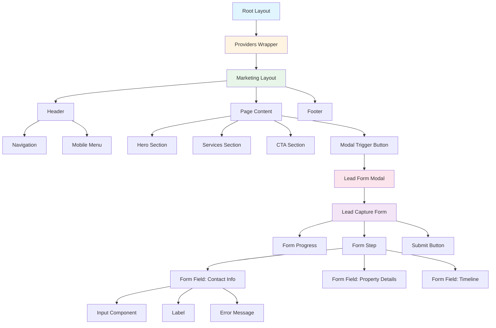
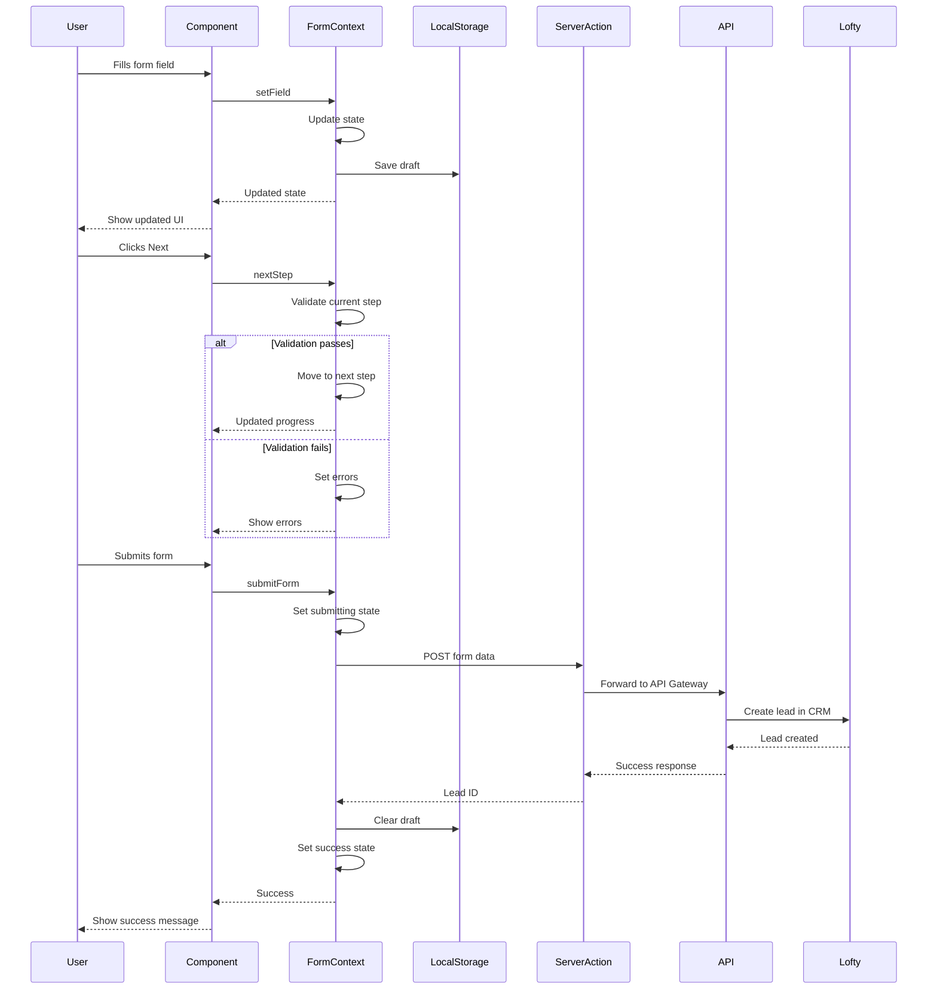

# Component Architecture & TypeScript Type System
## Real Estate Lead-Generation Application

**Project:** Joey O. Real Estate Lead-Generation Platform  
**Focus:** Component architecture, TypeScript interfaces, state management  
**Approach:** Hybrid (Feature-based + Atomic Design principles)  
**State Management:** React built-in (useState, useReducer, Context API)

---

## Table of Contents

1. [Component Organization Strategy](#component-organization-strategy)
2. [TypeScript Type System](#typescript-type-system)
3. [Component Hierarchy](#component-hierarchy)
4. [State Management Architecture](#state-management-architecture)
5. [Component Composition Patterns](#component-composition-patterns)
6. [Architectural Decisions & Rationale](#architectural-decisions--rationale)

---

## Component Organization Strategy

### Chosen Approach: Hybrid (Feature-based + Atomic Design)

**Decision:** Use a **hybrid approach** combining feature-based organization with Atomic Design principles.

**Structure:**
```
src/components/
├── ui/                    # Atomic: Atoms (primitives)
├── forms/                 # Feature: Form components
├── modals/                # Feature: Modal components
├── layout/                # Feature: Layout components
├── sections/              # Atomic: Organisms (composed sections)
└── providers/             # Feature: Context providers
```

**Rationale:**

1. **Feature-based for business logic** - Forms, modals, and layout are grouped by their business purpose
2. **Atomic Design for reusability** - UI primitives and sections follow composition hierarchy
3. **Scalability** - Easy to add new features without restructuring
4. **Developer experience** - Clear mental model: "Where does this component go?"
5. **Aligns with existing structure** - Matches the directory structure in [`ARCHITECTURE.md`](ARCHITECTURE.md)

### Component Classification

| Category | Type | Examples | Reusability |
|----------|------|----------|-------------|
| **Atoms** | UI Primitives | Button, Input, Badge | High |
| **Molecules** | Simple Compositions | FormField (Input + Label + Error) | High |
| **Organisms** | Complex Compositions | LeadCaptureForm, Header | Medium |
| **Templates** | Page Layouts | MarketingLayout | Low |
| **Features** | Business Logic | LeadFormModal, FormProgress | Medium |

---

## TypeScript Type System

### Overview

The type system is organized into domain-specific modules:

- [`lead.ts`](src/types/lead.ts) - Lead data structures and enums
- [`property.ts`](src/types/property.ts) - Property request types
- [`ai.ts`](src/types/ai.ts) - AI interaction and conversation types
- [`form.ts`](src/types/form.ts) - Form state and validation types
- [`ui.ts`](src/types/ui.ts) - Global UI state types
- [`api.ts`](src/types/api.ts) - API request/response types
- [`utils.ts`](src/types/utils.ts) - Type utilities and helpers

### Core Data Models

#### 1. Lead Types ([`src/types/lead.ts`](src/types/lead.ts))

```typescript
/**
 * Lead source tracking - where the lead originated
 */
export enum LeadSource {
  WEBSITE = 'website',
  FACEBOOK = 'facebook',
  GOOGLE = 'google',
  REFERRAL = 'referral',
  DIRECT = 'direct',
  OTHER = 'other',
}

/**
 * User intent - what service they're interested in
 */
export enum LeadIntent {
  BUY = 'buy',
  SELL = 'sell',
  INSURANCE = 'insurance',
  CLOSING = 'closing',
  GENERAL = 'general',
}

/**
 * Lead status in the CRM pipeline
 */
export enum LeadStatus {
  NEW = 'new',
  CONTACTED = 'contacted',
  QUALIFIED = 'qualified',
  NURTURING = 'nurturing',
  CONVERTED = 'converted',
  LOST = 'lost',
}

/**
 * Timeline for when the lead wants to take action
 */
export enum Timeline {
  IMMEDIATE = 'immediate',        // 0-30 days
  SHORT_TERM = 'short_term',      // 1-3 months
  MEDIUM_TERM = 'medium_term',    // 3-6 months
  LONG_TERM = 'long_term',        // 6+ months
  EXPLORING = 'exploring',        // Just researching
}

/**
 * Core lead data structure
 */
export interface Lead {
  id: string;
  
  // Contact Information
  firstName: string;
  lastName: string;
  email: string;
  phone: string;
  
  // Lead Context
  intent: LeadIntent;
  source: LeadSource;
  status: LeadStatus;
  timeline: Timeline;
  
  // Property Request (optional, populated in multi-step form)
  propertyRequest?: PropertyRequest;
  
  // Metadata
  createdAt: Date;
  updatedAt: Date;
  lastContactedAt?: Date;
  
  // CRM Integration
  loftyLeadId?: string;
  
  // Tracking
  utmSource?: string;
  utmMedium?: string;
  utmCampaign?: string;
  referrerUrl?: string;
}

/**
 * Lead creation payload (what the form submits)
 */
export interface CreateLeadInput {
  firstName: string;
  lastName: string;
  email: string;
  phone: string;
  intent: LeadIntent;
  source: LeadSource;
  timeline: Timeline;
  propertyRequest?: Partial<PropertyRequest>;
  utmSource?: string;
  utmMedium?: string;
  utmCampaign?: string;
  referrerUrl?: string;
}

/**
 * Lead update payload (for status changes, etc.)
 */
export interface UpdateLeadInput {
  status?: LeadStatus;
  timeline?: Timeline;
  propertyRequest?: Partial<PropertyRequest>;
  lastContactedAt?: Date;
}
```

#### 2. Property Request Types ([`src/types/property.ts`](src/types/property.ts))

```typescript
/**
 * Property type classification
 */
export enum PropertyType {
  SINGLE_FAMILY = 'single_family',
  CONDO = 'condo',
  TOWNHOUSE = 'townhouse',
  MULTI_FAMILY = 'multi_family',
  LAND = 'land',
  COMMERCIAL = 'commercial',
}

/**
 * Buyer/Seller preferences and requirements
 */
export interface PropertyRequest {
  // Common Fields
  propertyType: PropertyType[];
  
  // Location Preferences
  preferredLocations: string[];      // City, neighborhood, zip codes
  maxCommuteMinutes?: number;
  
  // Buyer-Specific Fields
  priceRangeMin?: number;
  priceRangeMax?: number;
  bedrooms?: number;
  bathrooms?: number;
  squareFeetMin?: number;
  squareFeetMax?: number;
  mustHaveFeatures?: string[];       // Pool, garage, yard, etc.
  
  // Seller-Specific Fields
  currentPropertyAddress?: string;
  estimatedValue?: number;
  reasonForSelling?: string;
  idealSaleDate?: Date;
  
  // Additional Context
  additionalNotes?: string;
  preApproved?: boolean;             // For buyers
  workingWithAgent?: boolean;
}

/**
 * Property request creation (partial for multi-step forms)
 */
export type CreatePropertyRequestInput = Partial<PropertyRequest>;
```

#### 3. AI Interaction Types ([`src/types/ai.ts`](src/types/ai.ts))

```typescript
/**
 * AI message role
 */
export enum AIMessageRole {
  USER = 'user',
  ASSISTANT = 'assistant',
  SYSTEM = 'system',
}

/**
 * Individual message in conversation
 */
export interface AIMessage {
  id: string;
  role: AIMessageRole;
  content: string;
  timestamp: Date;
  metadata?: Record<string, unknown>;
}

/**
 * AI conversation context
 */
export interface AIConversationContext {
  leadId: string;
  intent: LeadIntent;
  propertyRequest?: PropertyRequest;
  conversationHistory: AIMessage[];
  lastInteractionAt: Date;
}

/**
 * AI recommendation for lead follow-up
 */
export interface AIRecommendation {
  id: string;
  leadId: string;
  type: 'property_match' | 'follow_up_message' | 'next_step';
  title: string;
  description: string;
  priority: 'low' | 'medium' | 'high';
  actionUrl?: string;
  createdAt: Date;
  expiresAt?: Date;
}

/**
 * AI chat request payload
 */
export interface AIChatRequest {
  leadId: string;
  message: string;
  context?: Partial<AIConversationContext>;
}

/**
 * AI chat response
 */
export interface AIChatResponse {
  message: AIMessage;
  recommendations?: AIRecommendation[];
  suggestedActions?: string[];
}
```

#### 4. Form State Types ([`src/types/form.ts`](src/types/form.ts))

```typescript
/**
 * Form field validation error
 */
export interface FormFieldError {
  field: string;
  message: string;
  type: 'required' | 'invalid' | 'min' | 'max' | 'pattern' | 'custom';
}

/**
 * Form validation state
 */
export interface FormValidationState {
  isValid: boolean;
  errors: FormFieldError[];
  touchedFields: Set<string>;
}

/**
 * Multi-step form progress
 */
export interface FormProgress {
  currentStep: number;
  totalSteps: number;
  completedSteps: Set<number>;
  canProceed: boolean;
}

/**
 * Form submission state
 */
export interface FormSubmissionState {
  isSubmitting: boolean;
  isSuccess: boolean;
  isError: boolean;
  error?: string;
  submittedAt?: Date;
}

/**
 * Complete form state for lead capture
 */
export interface LeadFormState {
  // Form Data
  data: Partial<CreateLeadInput>;
  
  // Validation
  validation: FormValidationState;
  
  // Progress (for multi-step)
  progress: FormProgress;
  
  // Submission
  submission: FormSubmissionState;
  
  // Persistence
  isDirty: boolean;
  lastSavedAt?: Date;
}

/**
 * Form field configuration
 */
export interface FormFieldConfig<T = unknown> {
  name: string;
  label: string;
  type: 'text' | 'email' | 'tel' | 'select' | 'textarea' | 'checkbox' | 'radio';
  placeholder?: string;
  required?: boolean;
  disabled?: boolean;
  defaultValue?: T;
  validation?: {
    pattern?: RegExp;
    min?: number;
    max?: number;
    minLength?: number;
    maxLength?: number;
    custom?: (value: T) => boolean | string;
  };
  options?: Array<{ value: string; label: string }>; // For select/radio
}

/**
 * Form step configuration (for multi-step forms)
 */
export interface FormStepConfig {
  id: string;
  title: string;
  description?: string;
  fields: FormFieldConfig[];
  validation?: (data: Partial<CreateLeadInput>) => FormFieldError[];
  canSkip?: boolean;
}
```

#### 5. UI State Types ([`src/types/ui.ts`](src/types/ui.ts))

```typescript
/**
 * Modal state
 */
export interface ModalState {
  isOpen: boolean;
  modalId: string | null;
  data?: Record<string, unknown>;
}

/**
 * Toast notification
 */
export interface Toast {
  id: string;
  type: 'success' | 'error' | 'warning' | 'info';
  title: string;
  message?: string;
  duration?: number;
  action?: {
    label: string;
    onClick: () => void;
  };
}

/**
 * Global loading state
 */
export interface LoadingState {
  isLoading: boolean;
  message?: string;
  progress?: number; // 0-100
}

/**
 * Global UI state
 */
export interface UIState {
  modals: ModalState;
  toasts: Toast[];
  loading: LoadingState;
  isMobileMenuOpen: boolean;
}
```

#### 6. API Types ([`src/types/api.ts`](src/types/api.ts))

```typescript
/**
 * Standard API response wrapper
 */
export interface ApiResponse<T = unknown> {
  success: boolean;
  data?: T;
  error?: {
    code: string;
    message: string;
    details?: Record<string, unknown>;
  };
  metadata?: {
    timestamp: Date;
    requestId: string;
  };
}

/**
 * API error
 */
export interface ApiError {
  code: string;
  message: string;
  statusCode: number;
  details?: Record<string, unknown>;
}

/**
 * Lead submission response
 */
export interface LeadSubmissionResponse {
  leadId: string;
  loftyLeadId?: string;
  message: string;
  nextSteps?: string[];
}

/**
 * Lofty CRM webhook payload
 */
export interface LoftyWebhookPayload {
  event: 'lead.created' | 'lead.updated' | 'lead.status_changed';
  leadId: string;
  timestamp: Date;
  data: Record<string, unknown>;
}
```

#### 7. Type Utilities ([`src/types/utils.ts`](src/types/utils.ts))

```typescript
/**
 * Make specific properties required
 */
export type RequireFields<T, K extends keyof T> = T & Required<Pick<T, K>>;

/**
 * Make specific properties optional
 */
export type PartialFields<T, K extends keyof T> = Omit<T, K> & Partial<Pick<T, K>>;

/**
 * Extract enum values as union type
 */
export type EnumValues<T> = T[keyof T];

/**
 * Form field value type based on field config
 */
export type FormFieldValue<T extends FormFieldConfig> = 
  T['type'] extends 'checkbox' ? boolean :
  T['type'] extends 'select' ? string :
  T['type'] extends 'tel' | 'email' | 'text' | 'textarea' ? string :
  unknown;

/**
 * Discriminated union for form steps
 */
export type FormStepData<T extends string> = {
  [K in T]: {
    step: K;
    data: Record<string, unknown>;
  };
}[T];
```

---

## Component Hierarchy

### Visual Component Tree



### Component Dependency Levels

```typescript
// Level 1: Atoms - No dependencies except external libs
ui/Button.tsx
ui/Input.tsx
ui/Select.tsx
ui/Textarea.tsx
ui/Badge.tsx
ui/Spinner.tsx
ui/Card.tsx

// Level 2: Molecules - Depend on atoms
forms/FormField.tsx          // Uses: Input, Label, ErrorMessage
forms/FormProgress.tsx       // Uses: Badge, Progress indicator

// Level 3: Organisms - Depend on molecules + atoms
forms/FormStep.tsx           // Uses: FormField, Button
forms/LeadCaptureForm.tsx    // Uses: FormStep, FormProgress, FormField
layout/Header.tsx            // Uses: Navigation, Button
layout/Navigation.tsx        // Uses: Button, Link

// Level 4: Features - Depend on organisms
modals/LeadFormModal.tsx     // Uses: LeadCaptureForm, Modal wrapper
sections/Hero.tsx            // Uses: Button, Card
sections/CTA.tsx             // Uses: Button, ModalTrigger

// Level 5: Templates - Depend on features
layout/MarketingLayout.tsx   // Uses: Header, Footer, all sections
```

---

## State Management Architecture

### State Organization Strategy

**Principle:** Colocate state as close to usage as possible, lift only when necessary.

```
Component State (useState)
    ↓ (when shared between siblings)
Parent Component State
    ↓ (when shared across features)
Context API
    ↓ (when truly global)
Root Providers
```

### State Management Layers

| Layer | Scope | Tools | Use Cases |
|-------|-------|-------|-----------|
| **Component** | Single component | useState, useReducer | Button loading, input value |
| **Parent** | Component tree | Props drilling | Form field values |
| **Feature** | Feature module | Context API | Form state, modal state |
| **Global** | Entire app | Context API | UI state, auth, theme |

### Context Providers Architecture

```typescript
// src/components/providers/Providers.tsx

import { ReactNode } from 'react';
import { UIProvider } from '@/lib/contexts/UIContext';
import { AnalyticsProvider } from './AnalyticsProvider';

export function Providers({ children }: { children: ReactNode }) {
  return (
    <UIProvider>
      <AnalyticsProvider>
        {children}
      </AnalyticsProvider>
    </UIProvider>
  );
}
```

### Data Flow Diagram



---

## Component Composition Patterns

### 1. Compound Components Pattern

**Use Case:** Complex components with multiple related sub-components

**Example:** Multi-step form with shared state

```typescript
// src/components/forms/LeadCaptureForm.tsx

import { LeadFormProvider, useLeadForm } from '@/lib/contexts/LeadFormContext';
import { FormStep } from './FormStep';
import { FormProgress } from './FormProgress';
import { Button } from '@/components/ui/Button';

export function LeadCaptureForm({ intent }: { intent: LeadIntent }) {
  return (
    <LeadFormProvider>
      <LeadCaptureFormContent intent={intent} />
    </LeadFormProvider>
  );
}

function LeadCaptureFormContent({ intent }: { intent: LeadIntent }) {
  const { state, nextStep, prevStep, submitForm } = useLeadForm();

  return (
    <div className="space-y-6">
      <FormProgress
        current={state.progress.currentStep}
        total={state.progress.totalSteps}
      />

      {state.progress.currentStep === 0 && <FormStep.ContactInfo />}
      {state.progress.currentStep === 1 && <FormStep.PropertyDetails intent={intent} />}
      {state.progress.currentStep === 2 && <FormStep.Timeline />}

      <div className="flex justify-between">
        {state.progress.currentStep > 0 && (
          <Button variant="outline" onClick={prevStep}>
            Back
          </Button>
        )}

        {state.progress.currentStep < state.progress.totalSteps - 1 ? (
          <Button variant="primary" onClick={nextStep}>
            Next
          </Button>
        ) : (
          <Button
            variant="primary"
            onClick={submitForm}
            isLoading={state.submission.isSubmitting}
          >
            Submit
          </Button>
        )}
      </div>
    </div>
  );
}
```

### 2. Render Props Pattern

**Use Case:** Flexible rendering with shared logic

**Example:** FormField with custom rendering

```typescript
// src/components/forms/FormField.tsx

import { ReactNode } from 'react';
import { useLeadForm } from '@/lib/contexts/LeadFormContext';
import { FormFieldConfig } from '@/types';

interface FormFieldProps<T = unknown> {
  config: FormFieldConfig<T>;
  children?: (props: {
    value: T;
    onChange: (value: T) => void;
    onBlur: () => void;
    error?: string;
  }) => ReactNode;
}

export function FormField<T = unknown>({ config, children }: FormFieldProps<T>) {
  const { state, setField, dispatch } = useLeadForm();

  const value = state.data[config.name as keyof typeof state.data] as T;
  const error = state.validation.errors.find((e) => e.field === config.name);
  const isTouched = state.validation.touchedFields.has(config.name);

  const handleChange = (newValue: T) => {
    setField(config.name as keyof CreateLeadInput, newValue);
  };

  const handleBlur = () => {
    dispatch({ type: 'TOUCH_FIELD', field: config.name });
  };

  // Custom render
  if (children) {
    return (
      <>
        {children({
          value,
          onChange: handleChange,
          onBlur: handleBlur,
          error: isTouched ? error?.message : undefined,
        })}
      </>
    );
  }

  // Default render
  return (
    <div className="space-y-2">
      <label className="block text-sm font-medium">
        {config.label}
        {config.required && <span className="text-red-500">*</span>}
      </label>

      <input
        type={config.type}
        value={value as string}
        onChange={(e) => handleChange(e.target.value as T)}
        onBlur={handleBlur}
        placeholder={config.placeholder}
        disabled={config.disabled}
        className="w-full px-4 py-2 border rounded-lg"
      />

      {isTouched && error && (
        <p className="text-sm text-red-500">{error.message}</p>
      )}
    </div>
  );
}
```

### 3. Discriminated Unions for Variants

**Use Case:** Type-safe component variants

**Example:** Button with strict variant types

```typescript
// src/components/ui/Button.tsx

import { ButtonHTMLAttributes, ReactNode } from 'react';
import { cn } from '@/lib/utils/cn';

type ButtonVariant =
  | { variant: 'primary'; size?: 'sm' | 'md' | 'lg' }
  | { variant: 'secondary'; size?: 'sm' | 'md' | 'lg' }
  | { variant: 'outline'; size?: 'sm' | 'md' | 'lg' }
  | { variant: 'ghost'; size?: 'sm' | 'md' | 'lg' }
  | { variant: 'danger'; size?: 'sm' | 'md' | 'lg' };

interface ButtonProps extends ButtonHTMLAttributes<HTMLButtonElement> {
  children: ReactNode;
  isLoading?: boolean;
}

type ButtonPropsWithVariant = ButtonProps & ButtonVariant;

export function Button({
  variant,
  size = 'md',
  children,
  isLoading,
  className,
  disabled,
  ...props
}: ButtonPropsWithVariant) {
  const baseStyles = 'inline-flex items-center justify-center font-medium rounded-lg transition-colors';

  const variantStyles = {
    primary: 'bg-blue-600 text-white hover:bg-blue-700',
    secondary: 'bg-gray-600 text-white hover:bg-gray-700',
    outline: 'border-2 border-gray-300 hover:bg-gray-50',
    ghost: 'hover:bg-gray-100',
    danger: 'bg-red-600 text-white hover:bg-red-700',
  };

  const sizeStyles = {
    sm: 'px-3 py-1.5 text-sm',
    md: 'px-4 py-2 text-base',
    lg: 'px-6 py-3 text-lg',
  };

  return (
    <button
      className={cn(
        baseStyles,
        variantStyles[variant],
        sizeStyles[size],
        (disabled || isLoading) && 'opacity-50 cursor-not-allowed',
        className
      )}
      disabled={disabled || isLoading}
      {...props}
    >
      {isLoading ? 'Loading...' : children}
    </button>
  );
}
```

### 4. Generic Components

**Use Case:** Reusable components that work with different data types

**Example:** Type-safe Select component

```typescript
// src/components/ui/Select.tsx

import { ReactNode } from 'react';

interface SelectOption<T> {
  value: T;
  label: string;
  disabled?: boolean;
}

interface SelectProps<T> {
  options: SelectOption<T>[];
  value: T;
  onChange: (value: T) => void;
  placeholder?: string;
  disabled?: boolean;
  renderOption?: (option: SelectOption<T>) => ReactNode;
}

export function Select<T extends string | number>({
  options,
  value,
  onChange,
  placeholder,
  disabled,
  renderOption,
}: SelectProps<T>) {
  return (
    <select
      value={value}
      onChange={(e) => onChange(e.target.value as T)}
      disabled={disabled}
      className="w-full px-4 py-2 border rounded-lg"
    >
      {placeholder && (
        <option value="" disabled>
          {placeholder}
        </option>
      )}

      {options.map((option) => (
        <option
          key={option.value}
          value={option.value}
          disabled={option.disabled}
        >
          {renderOption ? renderOption(option) : option.label}
        </option>
      ))}
    </select>
  );
}

// Usage with type inference
<Select<LeadIntent>
  options={[
    { value: 'buy', label: 'Buy a Home' },
    { value: 'sell', label: 'Sell a Home' },
  ]}
  value={intent}
  onChange={setIntent}
/>
```

### 5. Custom Hooks Pattern

**Use Case:** Reusable stateful logic

**Example:** Form validation hook

```typescript
// src/lib/hooks/useFormValidation.ts

import { useState, useEffect } from 'react';
import { FormFieldError, CreateLeadInput } from '@/types';
import { z } from 'zod';

const leadSchema = z.object({
  firstName: z.string().min(2, 'First name must be at least 2 characters'),
  lastName: z.string().min(2, 'Last name must be at least 2 characters'),
  email: z.string().email('Invalid email address'),
  phone: z.string().regex(/^\d{10}$/, 'Phone must be 10 digits'),
  intent: z.enum(['buy', 'sell', 'insurance', 'closing']),
  timeline: z.enum(['immediate', 'short_term', 'medium_term', 'long_term', 'exploring']),
});

export function useFormValidation(data: Partial<CreateLeadInput>) {
  const [errors, setErrors] = useState<FormFieldError[]>([]);
  const [isValid, setIsValid] = useState(false);

  useEffect(() => {
    const result = leadSchema.safeParse(data);

    if (result.success) {
      setErrors([]);
      setIsValid(true);
    } else {
      const formattedErrors: FormFieldError[] = result.error.errors.map((err) => ({
        field: err.path[0] as string,
        message: err.message,
        type: 'invalid',
      }));
      setErrors(formattedErrors);
      setIsValid(false);
    }
  }, [data]);

  return { errors, isValid };
}
```

---

## Architectural Decisions & Rationale

### 1. Hybrid Component Organization

**Decision:** Use feature-based structure with Atomic Design principles

**Rationale:**
- **Scalability:** Easy to add new features without restructuring
- **Discoverability:** Clear where components belong
- **Reusability:** UI primitives are separate and composable
- **Team collaboration:** Different developers can work on different features
- **Aligns with Next.js:** Matches App Router's feature-based routing

### 2. React Built-in State Management

**Decision:** Use useState, useReducer, and Context API instead of external libraries

**Rationale:**
- **Simplicity:** No additional dependencies to learn or maintain
- **Performance:** Context API is sufficient for this scale
- **Type safety:** Full TypeScript support out of the box
- **Server Components:** Works seamlessly with Next.js App Router
- **MVP focus:** Faster development without library overhead
- **Future flexibility:** Easy to migrate to Zustand/Redux if needed

### 3. Discriminated Unions for Type Safety

**Decision:** Use discriminated unions for component variants and form steps

**Rationale:**
- **Type safety:** Compiler catches invalid combinations
- **Autocomplete:** Better IDE support
- **Refactoring:** Easier to update variant logic
- **Documentation:** Types serve as documentation
- **Runtime safety:** Prevents invalid prop combinations

### 4. Compound Components for Forms

**Decision:** Use compound component pattern for multi-step forms

**Rationale:**
- **Flexibility:** Easy to customize form steps
- **Encapsulation:** Form logic stays within form components
- **Composition:** Steps can be reordered or conditionally rendered
- **Context sharing:** Steps share form state via context
- **Developer experience:** Intuitive API for form building

### 5. Form State Persistence

**Decision:** Auto-save form data to localStorage

**Rationale:**
- **User experience:** Don't lose progress on accidental close
- **Conversion optimization:** Reduce form abandonment
- **Privacy:** Data stays on user's device
- **Simple implementation:** No backend required
- **Progressive enhancement:** Works without JavaScript

### 6. Centralized Type Definitions

**Decision:** All types in [`/src/types`](src/types) directory

**Rationale:**
- **Single source of truth:** No duplicate type definitions
- **Reusability:** Types shared across client and server
- **Maintainability:** Easy to update types in one place
- **Import simplicity:** Barrel exports for clean imports
- **Type safety:** Compiler enforces consistency

### 7. Validation with Zod

**Decision:** Use Zod for runtime validation

**Rationale:**
- **Type inference:** Generate TypeScript types from schemas
- **Runtime safety:** Validate API responses and form data
- **Error messages:** Built-in error formatting
- **Composability:** Reuse schemas across client and server
- **Integration:** Works with React Hook Form (if added later)

### 8. Optimistic Updates

**Decision:** Update UI immediately, rollback on error

**Rationale:**
- **Perceived performance:** Instant feedback to users
- **Better UX:** No waiting for server response
- **Error handling:** Clear rollback on failure
- **Conversion optimization:** Reduces friction in form submission

### 9. Component Props Interfaces

**Decision:** Explicit interfaces for all component props

**Rationale:**
- **Type safety:** Catch prop errors at compile time
- **Documentation:** Props interface serves as documentation
- **Autocomplete:** Better IDE support
- **Refactoring:** Easy to update component APIs
- **Consistency:** Enforces consistent prop naming

### 10. Separation of Concerns

**Decision:** Separate contexts for different concerns (Form, UI, Analytics)

**Rationale:**
- **Performance:** Avoid unnecessary re-renders
- **Single responsibility:** Each context has one job
- **Testability:** Easier to test isolated contexts
- **Maintainability:** Changes don't affect unrelated features
- **Scalability:** Easy to add new contexts without conflicts

---

## Summary

This component architecture provides a **scalable, type-safe, and maintainable** foundation for the Joey O. Real Estate Lead-Generation Platform.

### Key Highlights

✅ **Hybrid organization** - Feature-based + Atomic Design for best of both worlds  
✅ **Comprehensive type system** - Enterprise-grade TypeScript interfaces  
✅ **React built-in state** - Simple, performant, no external dependencies  
✅ **Multi-step forms** - Context-based with persistence and validation  
✅ **Component composition** - Flexible patterns for reusability  
✅ **Type-safe variants** - Discriminated unions prevent errors  
✅ **Clear data flow** - Predictable state management  
✅ **MVP-focused** - Simple enough for quick development  
✅ **Future-proof** - Easy to extend and scale  

### Next Steps

1. **Review this architecture** - Confirm alignment with project goals
2. **Create type files** - Implement TypeScript interfaces in [`/src/types`](src/types)
3. **Build UI primitives** - Start with atoms in [`/src/components/ui`](src/components/ui)
4. **Implement contexts** - Create Form and UI context providers
5. **Build form components** - Multi-step lead capture form
6. **Integrate with backend** - Connect to Server Actions and API routes
7. **Test and iterate** - Validate with real user flows

This architecture is ready for implementation in Code mode.